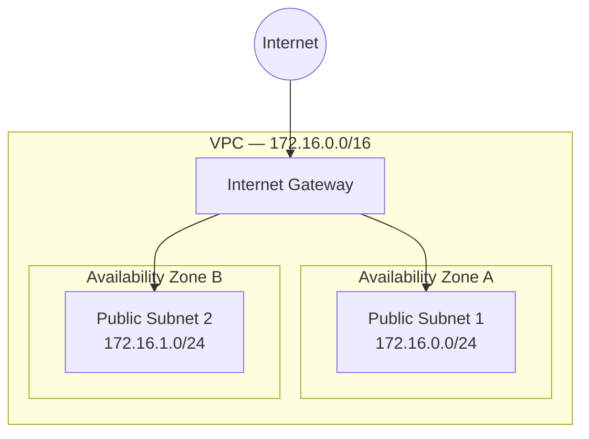

## Automate Infrastructure with IaC using Terraform — Part 1 (VPC & Subnets)


> **Series:** Part 1 of 4 — [Part 2](Project17.md) (compute, load balancing, RDS, EFS) · [Part 3](Project18.md) (modules) · [Part 4](Project19.md) (Terraform Cloud)
> **Level:** Beginner → Intermediate · **Time:** 2–3 hours · **Cost:** A VPC and subnets are free on their own — no billable resources are created in this part.

### Prerequisites
- An AWS account with an IAM user that has programmatic access (Access Key + Secret Key) and, at minimum, `AmazonVPCFullAccess` for this project (we'll talk about tightening this in [Security Considerations](#security-considerations)).
- AWS CLI installed and configured (`aws configure`).
- Terraform CLI installed — follow the [official install guide](https://developer.hashicorp.com/terraform/install). Verify with `terraform version`; this project assumes Terraform 1.x with the AWS provider v4 or later.
- Basic comfort with the command line and a text editor (VS Code with the HashiCorp Terraform extension is recommended for syntax highlighting and validation).
- **No prior Terraform experience is assumed** — this is where the IaC track starts.

---

## 1. Concept: What We're Building and Why Terraform

By the end of this 4-part series you will have hand-built (in code) the same kind of three-tier AWS network that underpins most production web applications:

- A VPC
- 6 subnets (2 public, 2 private for webservers, 2 private for the data layer), spread across 2 Availability Zones for high availability
- Route tables for public and private subnets
- An Internet Gateway (for public subnet internet access)
- NAT Gateways with Elastic IPs (so private subnets can reach the internet outbound without being reachable inbound)
- Security Groups
- EC2 instances, Launch Templates, Target Groups, and Auto Scaling Groups
- Application Load Balancers (ALB) with TLS certificates
- EFS (shared file storage) and RDS (managed database)
- DNS with Route 53

**Part 1** covers just the first two: the VPC and public subnets — but it's the part that teaches you the Terraform habits (variables, data sources, dynamic counts) you'll lean on for everything else.

### Why Terraform (and why not just click around the AWS Console)?

Manually clicking through the AWS Console to build this (as you may have done in earlier projects) works for a one-off lab, but it doesn't scale as an engineering practice:

| Console-driven ("ClickOps") | Infrastructure as Code (Terraform) |
|---|---|
| No record of *why* a setting was chosen | Every change is a diffable, reviewable line of code |
| Hard to reproduce identically in another environment (dev/staging/prod drift) | `terraform apply` builds identical environments from the same code |
| Tribal knowledge — only the person who clicked knows what exists | Self-documenting; `main.tf` *is* the documentation |
| No rollback except manual undo | `git revert` + `terraform apply` |
| Doesn't fit in a CI/CD pipeline | Runs in Jenkins/GitLab CI/GitHub Actions like any other code (see [Project 24](Project24.md)) |

This is also *why* Terraform is a core DevOps/Platform Engineer skill, not a "nice to have" — it's usually a required interview topic alongside Kubernetes and CI/CD.

---

## 2. Architecture Diagram


*(This part builds the VPC and the two public subnets shown above. Private subnets, NAT Gateways, and everything else in the diagram in the intro come in [Part 2](Project17.md).)*

---

## 3. Hands-On Implementation

### Step 1: Create the VPC

1. In VS Code (or your editor of choice), create a folder called **PBL**, then create a file inside it named **main.tf**.
2. Declare the AWS provider and the VPC resource. The **provider block** tells Terraform which cloud/region to talk to; the **resource block** defines what to create — in this case, the VPC itself.

```hcl
provider "aws" {
  region = "us-east-1"
}

# Create VPC
resource "aws_vpc" "main" {
  cidr_block           = "172.16.0.0/16"
  enable_dns_support   = "true"
  enable_dns_hostnames = "true"
}
```

> ⚠️ **Don't add `enable_classiclink` or `enable_classiclink_dns_support`.** You'll see these in some older tutorials. They relate to EC2-Classic, which AWS fully retired in 2022, and the `aws_vpc` resource no longer accepts these arguments in AWS provider v4+ — including them will make `terraform plan` fail with an "unsupported argument" error.

3. Initialize the working directory. This downloads the AWS provider plugin (and any others referenced in your code) into a local `.terraform/` directory:
```bash
terraform init
```
Expected output:
```
Initializing the backend...

Initializing provider plugins...
- Finding hashicorp/aws versions matching ">= 4.0.0"...
- Installing hashicorp/aws v5.31.0...
- Installed hashicorp/aws v5.31.0 (signed by HashiCorp)

Terraform has been successfully initialized!

You may now begin working with Terraform. Try running "terraform plan" to see
any changes that are required for your infrastructure.
```
4. Preview what Terraform intends to create — **always do this before `apply`**, especially once you're not working solo:
```bash
terraform plan
```
Expected output (abbreviated):
```
Terraform used the selected providers to generate the following execution plan.
Resource actions are indicated with the following symbols:
  + create

Terraform will perform the following actions:

  # aws_vpc.main will be created
  + resource "aws_vpc" "main" {
      + cidr_block           = "172.16.0.0/16"
      + enable_dns_hostnames = true
      + enable_dns_support   = true
      + id                   = (known after apply)
      + ...
    }

Plan: 1 to add, 0 to change, 0 to destroy.
```
5. If the plan looks correct, apply it:
```bash
terraform apply
```
Type `yes` when prompted. On success:
```
aws_vpc.main: Creating...
aws_vpc.main: Creation complete after 2s [id=vpc-0a1b2c3d4e5f6g7h8]

Apply complete! Resources: 1 added, 0 changed, 0 destroyed.
```

> 🔍 **Reading a plan like an engineer, not just a checklist:** the `+`/`-`/`~` symbols matter as much as the resource names. `+` is a create, `-` is a destroy, `~` is an in-place update, and `-/+` is destroy-then-recreate (the most dangerous one to skim past — it usually means a change to an *immutable* attribute, like `availability_zone` on an existing subnet). Get in the habit of reading the full plan output, especially the summary line (`Plan: X to add, Y to change, Z to destroy`), before typing `yes` — this is the single habit that prevents most "oops, that deleted production" incidents.

> **What just happened, mechanically:** Terraform now creates a **`terraform.tfstate`** file in your working directory. This is Terraform's source of truth for what it believes exists in AWS — every subsequent `plan`/`apply` diffs your `.tf` code against this file (not against AWS directly, though it does refresh from AWS first) to work out what to change. A **`terraform.tfstate.lock.info`** file also appears briefly during any operation and is removed when it finishes; it exists to stop two people (or two CI jobs) from running Terraform against the same state at the same time. Losing or hand-editing `.tfstate` is one of the most common ways people break a Terraform-managed environment — treat it as generated output, never hand-edit it, and never commit it to a public repo (it can contain sensitive values).

### Step 2: Create Public Subnets (the naive way, first)

We need 6 subnets total for the final architecture (2 public, 2 private for webservers, 2 private for data), split across 2 Availability Zones. This part creates only the 2 public subnets.

Add this to `main.tf`:

```hcl
# Create public subnet 1
resource "aws_subnet" "public1" {
  vpc_id                  = aws_vpc.main.id
  cidr_block               = "172.16.0.0/24"
  map_public_ip_on_launch  = true
  availability_zone        = "us-east-1a"
}

# Create public subnet 2
resource "aws_subnet" "public2" {
  vpc_id                  = aws_vpc.main.id
  cidr_block               = "172.16.1.0/24"
  map_public_ip_on_launch  = true
  availability_zone        = "us-east-1b"
}
```

Note the `aws_vpc.main.id` reference — this is Terraform's **interpolation** syntax. It tells Terraform "this subnet belongs inside the VPC resource named `main`," and it also creates an implicit dependency: Terraform will always create the VPC before the subnets that reference it, without you needing to say so explicitly.

Run `terraform plan` then `terraform apply` to create these.

**This code works, but has two real problems** that would bite you in a production codebase:

- **Hardcoded values.** `availability_zone` and `cidr_block` are typed literally. If this code needs to run in a different region, or a different AZ is unavailable, you have to hunt through the file and edit strings by hand.
- **Repeated resource blocks.** We wrote the `aws_subnet` block twice, with only two values changed. Imagine needing 20 subnets — this doesn't scale, and any bug fix has to be applied N times.

Before refactoring, tear this down so we don't leave orphaned resources while we rewrite the code:
```bash
terraform destroy
```
Review the plan, then type `yes` to confirm.

### Step 3: Refactor — Introduce Variables

Replace the hardcoded provider region with a variable:

```hcl
variable "region" {
  default = "us-east-1"
}

provider "aws" {
  region = var.region
}
```

Do the same for every hardcoded value in the VPC block:

```hcl
variable "region" {
  default = "us-east-1"
}

variable "vpc_cidr" {
  default = "172.16.0.0/16"
}

variable "enable_dns_support" {
  default = "true"
}

variable "enable_dns_hostnames" {
  default = "true"
}

provider "aws" {
  region = var.region
}

# Create VPC
resource "aws_vpc" "main" {
  cidr_block           = var.vpc_cidr
  enable_dns_support   = var.enable_dns_support
  enable_dns_hostnames = var.enable_dns_hostnames
}
```

### Step 4: Refactor — Stop Hardcoding Availability Zones with a Data Source

Instead of typing `"us-east-1a"`, ask AWS which AZs are actually available in the region you're deploying to, using a **data source**. Data sources are how Terraform reads information that already exists (in AWS, or elsewhere) without managing it:

```hcl
# Get list of availability zones
data "aws_availability_zones" "available" {
  state = "available"
}
```

Now use it to drive subnet creation, and collapse the two duplicated subnet blocks into one using `count`:

```hcl
# Create public subnets
resource "aws_subnet" "public" {
  count             = 2
  vpc_id            = aws_vpc.main.id
  cidr_block        = "172.16.1.0/24"
  map_public_ip_on_launch = true
  availability_zone = data.aws_availability_zones.available.names[count.index]
}
```

- `count = 2` tells Terraform to create this resource twice — internally, each instance is addressed as `aws_subnet.public[0]` and `aws_subnet.public[1]`.
- `data.aws_availability_zones.available.names` returns a list of AZ names for the current region (e.g. `["us-east-1a", "us-east-1b", "us-east-1c", ...]`); `[count.index]` picks a different one for each loop iteration (index `0`, then `1`).

> This still has a bug — every subnet gets the exact same `cidr_block`, which is invalid (AWS will reject overlapping CIDRs in the same VPC). We fix that next.

### Step 5: Refactor — Make the CIDR Block Dynamic

Use the built-in `cidrsubnet()` function to carve a unique CIDR block per subnet automatically: `cidrsubnet(prefix, newbits, netnum)`.

```hcl
resource "aws_subnet" "public" {
  count             = 2
  vpc_id            = aws_vpc.main.id
  cidr_block        = cidrsubnet(var.vpc_cidr, 4, count.index)
  map_public_ip_on_launch = true
  availability_zone = data.aws_availability_zones.available.names[count.index]
}
```

- **`prefix`** — the base CIDR block to carve from (must be in CIDR notation, same as the VPC).
- **`newbits`** — how many extra bits to extend the prefix by. A `/16` prefix with `newbits = 4` produces `/20` subnets.
- **`netnum`** — which numbered sub-block to return, as a binary index. We pass `count.index`, so subnet 0 gets the first `/20` block, subnet 1 gets the second, and so on — guaranteeing they don't overlap.

### Step 6: Refactor — Derive the Subnet Count Instead of Hardcoding It

Right now `count = 2` is still a hardcoded magic number. Replace it with `length()`, which counts the items in a list:

```hcl
resource "aws_subnet" "public" {
  count             = length(data.aws_availability_zones.available.names)
  vpc_id            = aws_vpc.main.id
  cidr_block        = cidrsubnet(var.vpc_cidr, 4, count.index)
  map_public_ip_on_launch = true
  availability_zone = data.aws_availability_zones.available.names[count.index]
}
```

> **Note:** This looks like an improvement, but it actually breaks the business requirement. `length(...)` will return however many AZs the region has (6 in `us-east-1` at the time of writing, but AWS adds AZs over time — never hardcode this number either) — not the 2 public subnets our architecture calls for. We need "use this many, unless told otherwise."

### Step 7: Combine Both — a Sensible Default *and* an Override

Declare a variable for the desired subnet count, defaulting to `null`:

```hcl
variable "preferred_number_of_public_subnets" {
  default = 2
}
```

Then use Terraform's conditional (ternary) expression to fall back to `length()` only when the preferred count isn't set:

```hcl
resource "aws_subnet" "public" {
  count             = var.preferred_number_of_public_subnets == null ? length(data.aws_availability_zones.available.names) : var.preferred_number_of_public_subnets
  vpc_id            = aws_vpc.main.id
  cidr_block        = cidrsubnet(var.vpc_cidr, 4, count.index)
  map_public_ip_on_launch = true
  availability_zone = data.aws_availability_zones.available.names[count.index]
}
```

Reading the conditional left to right:
- `var.preferred_number_of_public_subnets == null` — is the variable unset?
- `? length(data.aws_availability_zones.available.names)` — if **true** (unset), fall back to "one subnet per available AZ."
- `: var.preferred_number_of_public_subnets` — if **false** (a value was provided), use exactly that number.

Your `main.tf` should now look like this in full:

```hcl
# Get list of availability zones
data "aws_availability_zones" "available" {
  state = "available"
}

variable "region" {
  default = "us-east-1"
}

variable "vpc_cidr" {
  default = "172.16.0.0/16"
}

variable "enable_dns_support" {
  default = "true"
}

variable "enable_dns_hostnames" {
  default = "true"
}

variable "preferred_number_of_public_subnets" {
  default = 2
}

provider "aws" {
  region = var.region
}

# Create VPC
resource "aws_vpc" "main" {
  cidr_block           = var.vpc_cidr
  enable_dns_support   = var.enable_dns_support
  enable_dns_hostnames = var.enable_dns_hostnames
}

# Create public subnets
resource "aws_subnet" "public" {
  count             = var.preferred_number_of_public_subnets == null ? length(data.aws_availability_zones.available.names) : var.preferred_number_of_public_subnets
  vpc_id            = aws_vpc.main.id
  cidr_block        = cidrsubnet(var.vpc_cidr, 4, count.index)
  map_public_ip_on_launch = true
  availability_zone = data.aws_availability_zones.available.names[count.index]
}
```

### Step 8: Split Into `variables.tf` and `terraform.tfvars`

Right now variable *declarations* and their *default values* live inline in `main.tf`. Real projects separate concerns into three files:

- **`main.tf`** — resource and data source definitions only.
- **`variables.tf`** — variable *declarations* (name, type, description) with no environment-specific values.
- **`terraform.tfvars`** — the actual *values* for this environment. This is the file you'd swap out per environment (dev/staging/prod).

**main.tf**
```hcl
# Get list of availability zones
data "aws_availability_zones" "available" {
  state = "available"
}

provider "aws" {
  region = var.region
}

# Create VPC
resource "aws_vpc" "main" {
  cidr_block           = var.vpc_cidr
  enable_dns_support   = var.enable_dns_support
  enable_dns_hostnames = var.enable_dns_hostnames
}

# Create public subnets
resource "aws_subnet" "public" {
  count             = var.preferred_number_of_public_subnets == null ? length(data.aws_availability_zones.available.names) : var.preferred_number_of_public_subnets
  vpc_id            = aws_vpc.main.id
  cidr_block        = cidrsubnet(var.vpc_cidr, 4, count.index)
  map_public_ip_on_launch = true
  availability_zone = data.aws_availability_zones.available.names[count.index]
}
```

**variables.tf**
```hcl
variable "region" {
  type        = string
  description = "AWS region to deploy into"
  default     = "us-east-1"
}

variable "vpc_cidr" {
  type        = string
  description = "CIDR block for the VPC"
  default     = "172.16.0.0/16"
}

variable "enable_dns_support" {
  type    = bool
  default = true
}

variable "enable_dns_hostnames" {
  type    = bool
  default = true
}

variable "preferred_number_of_public_subnets" {
  type        = number
  description = "Number of public subnets. Leave as null to create one per AZ."
  default     = null
}
```

**terraform.tfvars**
```hcl
region      = "us-east-1"
vpc_cidr    = "172.16.0.0/16"

enable_dns_support   = true
enable_dns_hostnames = true

preferred_number_of_public_subnets = 2
```

> 💡 A `.tfvars` file uses plain `key = value` pairs only — never `variable { }` blocks (that syntax belongs only in `variables.tf`). Mixing the two is a very common beginner mistake and produces a `variable ... is not expected here` or similar parse error.

Your project folder structure should now look like:
```
PBL/
├── main.tf
├── variables.tf
└── terraform.tfvars
```

Run `terraform plan` again. Terraform automatically loads `terraform.tfvars` if it's named exactly that — no extra flag needed.

### Step 9: Production-Grade Variant — `for_each` Instead of `count`

Everything above works and is exactly how most learners are first taught Terraform loops — but `count` has a structural weakness worth understanding before you write it into a real environment: **`count` addresses resources by numeric index** (`aws_subnet.public[0]`, `aws_subnet.public[1]`). If the *input list* that index is derived from ever reorders — which can happen if you change a data source filter, or AWS itself changes what it returns — Terraform doesn't see "the AZ for subnet 0 changed," it sees "subnet 0 is now a completely different resource," and proposes to **destroy and recreate it**. In a subnet that's just carrying traffic, that's disruptive; in a subnet holding a NAT Gateway's Elastic IP association or a stateful resource, it can cause an outage.

`for_each` avoids this because it keys resources by a **stable string**, not a position in a list — the resource's identity in state is tied to that key, not to list order.

Rewrite the public subnet resource using `for_each` over a map built from the AZ data source:

```hcl
locals {
  # Build a stable map of { "us-east-1a" = "172.16.0.0/20", "us-east-1b" = "172.16.16.0/20", ... }
  # keyed by AZ name instead of a numeric index.
  public_subnet_azs = slice(
    data.aws_availability_zones.available.names,
    0,
    var.preferred_number_of_public_subnets == null ? length(data.aws_availability_zones.available.names) : var.preferred_number_of_public_subnets
  )

  public_subnet_map = {
    for idx, az in local.public_subnet_azs :
    az => cidrsubnet(var.vpc_cidr, 4, idx)
  }
}

resource "aws_subnet" "public" {
  for_each = local.public_subnet_map

  vpc_id                  = aws_vpc.main.id
  cidr_block               = each.value
  availability_zone        = each.key
  map_public_ip_on_launch  = true

  tags = {
    Name        = "public-${each.key}"
    Environment = var.environment
    ManagedBy   = "terraform"
  }
}
```

Key differences from the `count` version:
- **`each.key`** is the AZ name (e.g. `"us-east-1a"`), **`each.value`** is its CIDR block — both come from the map, not an index.
- Terraform now tracks each subnet in state as `aws_subnet.public["us-east-1a"]`, `aws_subnet.public["us-east-1b"]`, etc. — human-readable in `terraform state list`, and immune to reordering.
- `locals` (introduced here) hold *computed* intermediate values that aren't inputs (`variable`) or outputs (`output`) — use them any time you're deriving one value from others, as we just did to build the map.

Any code downstream that referenced `aws_subnet.public[0].id` now needs to reference `aws_subnet.public["us-east-1a"].id` — or, better, use `values(aws_subnet.public)[*].id` if you just need "all of them" without caring which is which.

If you type this out yourself, add the `environment` variable the tags reference:
```hcl
variable "environment" {
  type        = string
  description = "Deployment environment, e.g. dev, staging, prod"
  default     = "dev"
}
```

> This is the version worth using from Part 2 onward — the `count` version above is the right way to *learn* the concepts, but `for_each` is the version you should actually carry forward into production code and into interviews.

---

## 4. Security Considerations

- **IAM least privilege.** The IAM user/role running Terraform in this lab only needs VPC permissions for Part 1. Don't hand it broad `AdministratorAccess` out of convenience — scope permissions to what each stage of the project actually needs, and tighten further before this pattern touches a real account. In a team setting, Terraform typically runs via an assumed IAM role from CI/CD (see [Project 24](Project24.md)), not a long-lived user access key. A least-privilege policy for exactly what Part 1 needs looks like this:
  ```json
  {
    "Version": "2012-10-17",
    "Statement": [
      {
        "Sid": "TerraformVpcPart1",
        "Effect": "Allow",
        "Action": [
          "ec2:CreateVpc",
          "ec2:DeleteVpc",
          "ec2:DescribeVpcs",
          "ec2:ModifyVpcAttribute",
          "ec2:CreateSubnet",
          "ec2:DeleteSubnet",
          "ec2:DescribeSubnets",
          "ec2:DescribeAvailabilityZones",
          "ec2:CreateTags",
          "ec2:DeleteTags",
          "ec2:DescribeTags"
        ],
        "Resource": "*"
      }
    ]
  }
  ```
  Attach this to a dedicated `terraform-lab` IAM user or role rather than reusing your personal admin credentials — it's both safer and it forces you to notice, immediately, when a later part of this series needs a permission you haven't granted yet (a very realistic production workflow: IAM policies for CI/CD service roles usually grow incrementally, permission-by-permission, as new resource types are added to the codebase).
  - This also maps to **CIS AWS Foundations Benchmark** control 1.16 ("Ensure IAM policies are attached only to groups or roles") and 1.2 (least privilege) — auditors and security reviews will specifically look for exactly this pattern: scoped policies attached to roles, not personal users with broad access.
- **Never commit `terraform.tfvars` or `.tfstate` if they contain secrets.** Neither file in this part happens to hold secrets, but later parts of this series introduce database passwords — add both to `.gitignore` now, before you need to remember to:
  ```
  *.tfstate
  *.tfstate.*
  *.tfvars
  .terraform/
  ```
  (You'll typically commit a `terraform.tfvars.example` with placeholder values instead, so teammates know what to fill in.)
- **State file confidentiality.** Local state (what we're using in Part 1) is stored in plaintext on disk. Anyone with access to `terraform.tfstate` can read every attribute of every resource it manages — including things that become sensitive later in this series, like RDS master passwords. [Part 3](Project18.md) moves state to an encrypted S3 backend with DynamoDB locking, which is the production-appropriate setup.
- **DNS resolution is intentional here.** `enable_dns_support` and `enable_dns_hostnames` are both `true` because later parts need private DNS resolution for RDS/EFS endpoints — don't disable these thinking you're "locking things down"; that's not what they control.

---

## 5. Common Issues & Troubleshooting

| Symptom | Likely Cause | Fix |
|---|---|---|
| `Error: Unsupported argument` mentioning `enable_classiclink` | Copied code from an older tutorial predating AWS provider v4 | Remove `enable_classiclink` / `enable_classiclink_dns_support` entirely — EC2-Classic no longer exists |
| `Error: Provider produced inconsistent final plan` or subnets being destroyed and recreated on every `apply` with no code change | Using `count` indexed against `data.aws_availability_zones.available.names` — if AWS ever returns the AZ list in a different order (rare, but it can happen, and definitely happens if you filter/change the data source), Terraform sees index `0` now pointing at a different AZ and wants to replace the resource | For anything beyond a lab, prefer `for_each` over `count` with a stable key (e.g. a map keyed by AZ name) so resource identity doesn't depend on list order — see the Challenge below |
| `Error: Invalid count argument` | `count` is set to a value that depends on a resource/data source not yet known at plan time (a "computed" value) in a way Terraform can't resolve before apply | Make sure the value driving `count` — here, `data.aws_availability_zones.available.names` — comes from a data source, not another resource being created in the same apply |
| `terraform plan` hangs or times out downloading providers | Corporate proxy/firewall blocking `registry.terraform.io`, or no internet access from your shell | Configure `HTTPS_PROXY`, or set up a local provider mirror; verify with `curl -I https://registry.terraform.io` |
| `Error: error configuring Terraform AWS Provider: no valid credential sources found` | AWS CLI not configured, or environment variables not exported in this shell session | Run `aws configure` and confirm with `aws sts get-caller-identity`; if using env vars, re-export them — they don't persist across terminal sessions |
| Subnet CIDR overlaps / `InvalidSubnet.Conflict` | Manually specifying `cidr_block` per subnet without `cidrsubnet()`, and two subnets end up with the same range | Use `cidrsubnet(var.vpc_cidr, newbits, count.index)` so each iteration gets a mathematically distinct block |
| `terraform apply` says resources already exist (`EntityAlreadyExists`, `Resource already exists`) | You created something manually via the Console, or a previous `apply` partially succeeded and state is now out of sync with reality | Either delete the manually-created resource, or bring it under Terraform's management with `terraform import` |
| Stuck state lock (`Error acquiring the state lock`) after a crashed `apply` | A previous run was killed mid-operation (Ctrl-C, connection drop) and never released its lock | With local state, delete the leftover `.terraform.tfstate.lock.info`; with a remote S3+DynamoDB backend (Part 3), use `terraform force-unlock <LOCK_ID>` — only after confirming no other apply is actually running |
| `Error: creating EC2 Subnet: InsufficientFreeAddressesInSubnet` or CIDR-related create failures on `apply` (but not on `plan`) | `newbits` in `cidrsubnet()` is too large for how many subnets you actually need, producing subnets too small to hold your instances, or the AZ you're placed in genuinely has no more capacity for that CIDR range | Increase the subnet's CIDR block (fewer `newbits`, e.g. `/24` instead of `/28`), or, if this is happening across an account, request an AZ capacity increase from AWS support |
| `terraform destroy` fails partway with a dependency error (e.g. "DependencyViolation: has some mapped public IP addresses") | A resource *outside* Terraform's knowledge is attached to what it's trying to delete — e.g. you manually attached an ENI or launched an instance into a Terraform-managed subnet via the Console | Terraform can only destroy what's in its own dependency graph; manually clean up out-of-band resources first (or better: never create resources by hand inside a Terraform-managed subnet) |
| Two engineers run `terraform apply` around the same time and one gets unexpected/conflicting changes | No remote backend with locking — each engineer has their own local `.tfstate`, so Terraform has no idea the other person's changes exist | This is precisely why Part 3 moves to an S3+DynamoDB remote backend — don't run shared infrastructure off local state past a solo lab |

**Why these matter beyond "the fix":** most of the entries above trace back to one root idea — **Terraform's state file is its only source of truth about what it manages**, and every failure mode above is really a mismatch between that state and either (a) your code, (b) the real AWS account, or (c) another engineer's parallel state. Once you internalize that, unfamiliar Terraform errors become much easier to reason about even without looking them up: ask "what does Terraform's state currently believe, and how does that differ from what I just told it or what AWS actually has?"

**General debugging habit:** run `terraform validate` (checks syntax) and `terraform fmt` (auto-formats) before every `plan`. For deeper debugging, `TF_LOG=DEBUG terraform apply` gives verbose provider-level logs — noisy, but it's usually where the real AWS API error message is hiding when Terraform's own error is vague. Useful state-inspection commands when something looks wrong:
```bash
terraform state list                 # what does Terraform think it manages?
terraform state show aws_vpc.main    # full current attributes of one resource
terraform plan -refresh-only         # show drift between state and real AWS, without changing anything
```

---

## 6. Best Practices

- **Pin your Terraform and provider versions.** Add a `terraform` block with `required_version` and a `required_providers` block pinning the AWS provider (e.g. `~> 5.0`). Without this, a `terraform init` six months from now can silently pull a newer provider with breaking changes.
  ```hcl
  terraform {
    required_version = ">= 1.5.0"
    required_providers {
      aws = {
        source  = "hashicorp/aws"
        version = "~> 5.0"
      }
    }
  }
  ```
- **Tag everything.** Untagged AWS resources are a recurring pain point in real environments — cost allocation, ownership, and security auditing all depend on tags. Add a `tags` argument to every resource (`Environment`, `Project`, `ManagedBy = "terraform"` at minimum). We'll formalize this with `default_tags` on the provider block in Part 2.
- **Run `terraform fmt` and `terraform validate` before every commit** — better yet, wire them into a pre-commit hook or your CI pipeline, alongside a linter like `tflint` and a security scanner like `tfsec` or `checkov` (both surface issues like open security groups or unencrypted resources before they ever reach `apply`).
- **Never hand-edit `.tfstate`.** If state and reality genuinely diverge, use `terraform import`, `terraform state rm`, or `terraform state mv` — all of which log what changed, unlike opening the JSON in an editor.
- **Prefer `for_each` over `count`** once resource identity matters (i.e., almost always outside of a quick lab) — it keys resources by a stable value instead of a fragile numeric index, which avoids the AZ-reordering resource-replacement issue in the table above.

---

## 7. Real-World Scenario

This VPC pattern — public subnets in ≥2 AZs, driven by variables and an AZ data source — is close to verbatim what you'll find at the bottom of most companies' "landing zone" Terraform module, whether it's hand-rolled like this or built on top of the [terraform-aws-modules/vpc](https://github.com/terraform-aws-modules/terraform-aws-vpc) community module. In a real platform team, this code wouldn't live as a single `main.tf` invoked by hand — it would be:
- Stored in Git, with `terraform plan` running automatically on every pull request (via Jenkins/GitHub Actions/GitLab CI — see [Project 24](Project24.md)) so reviewers see the *diff of infrastructure changes*, not just code.
- Applied only after PR approval, often gated behind a manual approval step for production.
- Backed by remote state in S3 with DynamoDB locking (Part 3) so multiple engineers and CI jobs can't corrupt each other's runs.
- Parameterized per environment via separate `.tfvars` files (`dev.tfvars`, `prod.tfvars`) or Terraform workspaces.

---

## 8. Challenge

Before moving to Part 2, try extending this configuration yourself. Do these in order — each one builds on the last:

1. **Implement Step 9 yourself from scratch** (don't copy-paste) — write the `for_each` version, run `terraform plan`, and confirm it proposes the same 2 subnets as the `count` version. Then run `terraform state list` on both versions and note the difference in how resources are addressed.
2. **Add `output` blocks** for the VPC ID and the list of public subnet IDs, so a future `Part 2` configuration (or a teammate) can consume them without hardcoding:
   ```hcl
   output "vpc_id" {
     value = aws_vpc.main.id
   }

   output "public_subnet_ids" {
     value = values(aws_subnet.public)[*].id
   }
   ```
3. **Add a `tags` block** to both the VPC and subnet resources with `Name`, `Environment`, and `ManagedBy` tags, using variables rather than literals.
4. **Break it on purpose:** set `preferred_number_of_public_subnets = 10` and run `terraform plan`. Read the resulting CIDR blocks Terraform proposes — do they still fit inside `172.16.0.0/16` without overlapping? At what `newbits` value would they stop fitting? Work out the math by hand before checking Terraform's answer.
5. **Simulate the AZ-reordering bug.** On the `count` version only: manually reorder two elements in a hardcoded list standing in for the data source (e.g. temporarily replace the data source with a local list `["us-east-1b", "us-east-1a"]`, swap the order, `apply` again). Confirm in the plan output that Terraform proposes destroying and recreating a subnet even though nothing "real" changed — this is the failure mode Step 9 exists to prevent. Revert when done.

**Mini-project — "Multi-Environment VPC":** using everything above, produce a single codebase that can stand up either a `dev` (2 public subnets, `us-east-1`) or `staging` (3 public subnets, `us-east-1`) VPC from the same `main.tf`/`variables.tf`, differing only by which `.tfvars` file you pass in:
```bash
terraform apply -var-file="dev.tfvars"
terraform apply -var-file="staging.tfvars"
```
This is the actual pattern most teams use for environment promotion before they graduate to Terraform workspaces or separate state per environment (both covered later in this series).

---

## 9. Interview Q&A

Practical, scenario-based questions an interviewer might ask off the back of this project — not just "define Terraform":

**Q: Walk me through what happens, step by step, when I run `terraform apply`.**
A: Terraform first refreshes state (queries real AWS for the current status of every resource it manages, unless `-refresh=false`), then builds a dependency graph from the `.tf` files, computes a diff between desired state (code) and last-known state, shows that as a plan, and — after confirmation — calls the AWS API to make only the necessary changes, updating `.tfstate` after each successful resource operation (not all at once at the end).

**Q: Why prefer a data source (`data "aws_availability_zones"`) over hardcoding `"us-east-1a"`?**
A: Hardcoding ties the code to one specific region/account's AZ layout — AZ names aren't even guaranteed to map to the same physical infrastructure across different AWS accounts. A data source reads the actual environment at plan/apply time, so the same code is portable across regions and accounts without edits.

**Q: What's the actual difference between `count` and `for_each`, beyond syntax?**
A: `count` produces a list, addressed by integer index (`resource[0]`, `resource[1]`); `for_each` produces a map (or set), addressed by a stable key. The practical consequence is resource *identity* in state: with `count`, if the underlying list reorders, Terraform can misattribute index `0` to a different logical resource and propose destroying/recreating it. `for_each` ties identity to the key itself, which doesn't shift.

**Q: What's actually inside `terraform.tfstate`, and why is it sensitive?**
A: A JSON representation of every resource Terraform manages, including all of that resource's attributes as returned by the cloud provider — which, for some resource types (RDS instances, Secrets Manager references, some provider configs), includes values that count as secrets. That's why state should never be committed to a public repo, and why production setups use an encrypted remote backend with tightly scoped access, not a local file.

**Q: If two engineers apply Terraform to the same infrastructure at the same time with local state, what breaks?**
A: Nothing stops them — that's the problem. Each has their own local `.tfstate`, unaware of the other's changes, so whichever applies last can silently overwrite or conflict with the first engineer's changes, and both state files now disagree with real AWS and with each other. This is solved with a remote backend (S3) plus state locking (DynamoDB), covered in Part 3.

---

## 10. Next Steps

Continue to **[Project 17 — Part 2](Project17.md)**, where this same VPC gets private subnets, an Internet Gateway, NAT Gateways, a bastion host, an Application Load Balancer, Auto Scaling Groups, RDS, and EFS — all using the variable/data-source patterns you just practiced here.

Before moving on, run `terraform destroy` to tear down what you built in this lab and avoid leaving orphaned resources in your AWS account.
