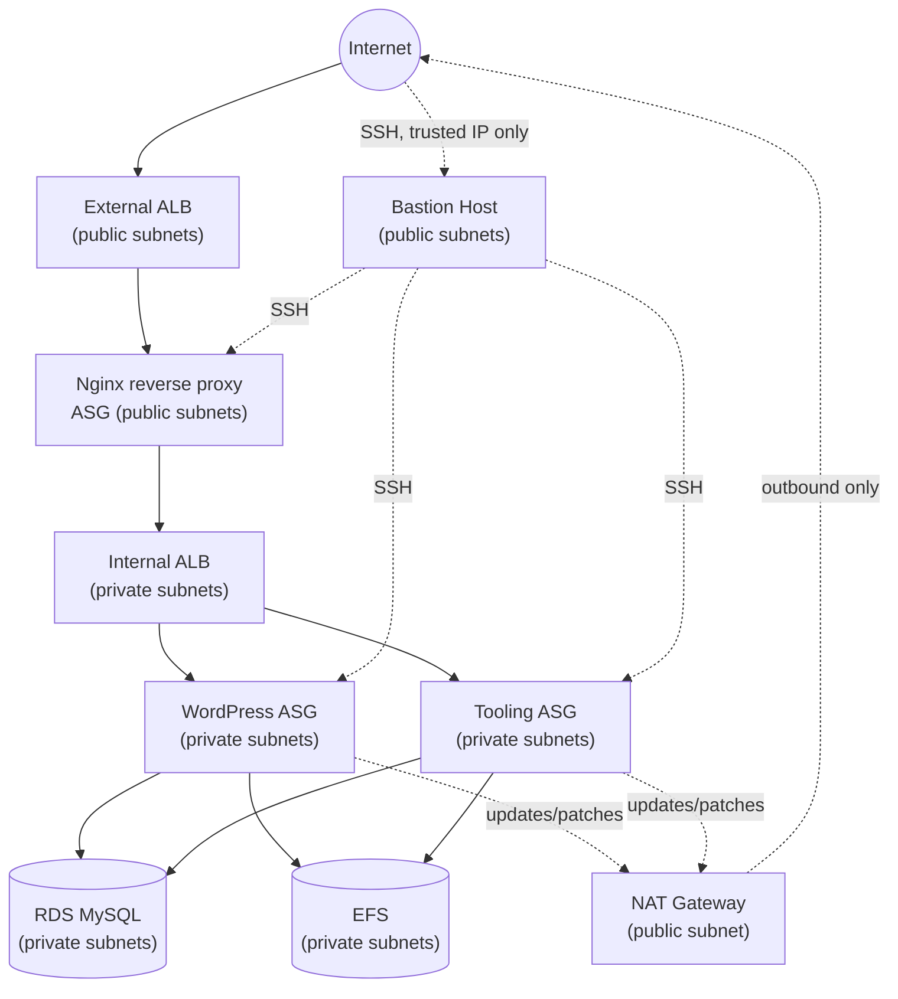

## Automate Infrastructure with IaC using Terraform — Part 2 (Compute, Load Balancing, RDS & EFS)

> **Series:** Part 2 of 4 — [Part 1](Project16.md) (VPC & subnets) · [Part 3](Project18.md) (modules) · [Part 4](Project19.md) (Terraform Cloud)
> **Level:** Intermediate · **Time:** 4–6 hours · **Cost:** ⚠️ This part creates billable resources that are **not** free-tier eligible — NAT Gateway, Application Load Balancers, and RDS all charge hourly regardless of traffic. Destroy everything (`terraform destroy`) as soon as you're done. Expect roughly $3–6 if you complete this lab in a single day and tear down promptly; leaving it running racks up charges continuously.

### Prerequisites
- Completed [Part 1](Project16.md) — this project continues that VPC/subnet codebase.
- A registered domain name you control (for the ACM certificate + Route 53 records) — a free option like a `.tk`/`.click` domain from a registrar, or any domain you already own, works fine for the lab.
- Comfort with the Terraform fundamentals from Part 1 (`count`, `for_each`, data sources, `.tfvars`).

In continuation to [Project 16](Project16.md), this project creates the rest of the architecture. In this part you will build:
1. **Networking** — in addition to the VPC and 2 public subnets from Project 16:
   - 4 private subnets (2 for the webserver tier, 2 for the data tier)
   - Internet Gateway
   - NAT Gateway + Elastic IP
   - Route tables (public and private) and their associations
2. **Identity and Access Management**
   - An IAM role for EC2 instances, with a scoped policy attached
3. **Everything else:**
   - Security Groups (one per tier, chained together — see the diagram below)
   - Target Groups for Nginx, WordPress, and Tooling
   - An ACM certificate, validated via Route 53 DNS
   - External and Internal Application Load Balancers
   - Launch Templates and Auto Scaling Groups for Bastion, Nginx, WordPress, and Tooling
   - Elastic File System (EFS) for shared WordPress/Tooling storage
   - RDS (MySQL) for the data layer

### Architecture Diagram


*Solid arrows are application traffic; dashed arrows are administrative/outbound-only paths. Nothing in the private subnets is directly reachable from the internet — every path in either terminates at the External ALB or the Bastion host.*

---

## Hands-On Implementation

#### Create Private subnets
1. Let's modify our code used in creating the public subnets and create the private subnets:
```
# Create private subnets
resource "aws_subnet" "private" {
  count                   = var.preferred_number_of_private_subnets == null ? length(data.aws_availability_zones.available.names) : var.preferred_number_of_private_subnets
  vpc_id                  = aws_vpc.main.id
  cidr_block              = cidrsubnet(var.vpc_cidr, 8, count.index + 2)
  map_public_ip_on_launch = false
  availability_zone       = data.aws_availability_zones.available.names[count.index]

tags = merge(
    var.tags,
    {
      Name = format("%s-PrivateSubnet-%s", var.name, count.index)
    },
  )

}
```

> 🔒 **Note:** `map_public_ip_on_launch` is `false` here, unlike the public subnets in Part 1. This is the whole point of a *private* subnet — instances launched into it get no public IP, so they're unreachable directly from the internet. This is what makes the webservers and data layer we'll place here secure-by-default; they'll only be reachable through the internal load balancer and via the bastion host, both configured later in this project.

#### Internet Gateways & format() function
1. Create a new file and name it `internet_gateway.tf` then create an Internet Gateway in file with the following code:
```
resource "aws_internet_gateway" "ig" {
  vpc_id = aws_vpc.main.id

  tags = merge(
    var.tags,
    {
      Name = format("%s-IGW", var.name)
    } 
  )
}
```
#### NAT Gateway
1. Create a NAT Gateways and an Elastic IP (EIP) address and allocate the EIP to the NAT gateway. Create the NAT Gateway in a new file called `natgateway.tf` and use the following code snippet to create:
```
resource "aws_eip" "nat_eip" {
  domain     = "vpc"
  depends_on = [aws_internet_gateway.ig]

  tags = merge(
    var.tags,
    {
      Name = format("%s-EIP", var.name)
    },
  )
}

resource "aws_nat_gateway" "nat" {
  allocation_id = aws_eip.nat_eip.id
  subnet_id     = element(aws_subnet.public.*.id, 0)
  depends_on    = [aws_internet_gateway.ig]

  tags = merge(
    var.tags,
    {
      Name = format("%s-Nat", var.name)
    },
  )
}
```
> 💡 `vpc = true` was the old way to request an EIP for use in a VPC; it's deprecated in favor of `domain = "vpc"` in current AWS provider versions — `vpc = true` still parses but will emit a deprecation warning and is scheduled for eventual removal.

> ⚠️ **Cost vs. availability trade-off:** this creates a **single** NAT Gateway in one public subnet, shared by every private subnet across both AZs (~$0.045/hr + data processing charges — not free-tier eligible). That's fine for a lab, but it's a single point of failure: if that AZ has an outage, every private-subnet resource loses outbound internet access, even though the private subnets themselves span 2 AZs. Production HA setups create **one NAT Gateway per AZ** and route each AZ's private subnets to its own NAT Gateway. We call this out explicitly here because "shared NAT Gateway across AZs" is a very common cost-cutting compromise in early-stage infrastructure — know that you're making it, don't stumble into it.
#### Route tables
1. Next, create a file called `route_tables.tf``` and inside it create routes for both public and private subnets, and a route for the internet gateway, create the below resources. Ensure they are properly tagged.
```
# create private route table
resource "aws_route_table" "private-rtb" {
  vpc_id = aws_vpc.main.id

  tags = merge(
    var.tags,
    {
      Name = format("%s-Private-Route-Table", var.name)
    },
  )
}

# associate all private subnets to the private route table
resource "aws_route_table_association" "private-subnets-assoc" {
  count          = length(aws_subnet.private[*].id)
  subnet_id      = element(aws_subnet.private[*].id, count.index)
  route_table_id = aws_route_table.private-rtb.id
}

# create route table for the public subnets
resource "aws_route_table" "public-rtb" {
  vpc_id = aws_vpc.main.id

  tags = merge(
    var.tags,
    {
      Name = format("%s-Public-Route-Table", var.name)
    },
  )
}

# create route for the public route table and attach the internet gateway
resource "aws_route" "public-rtb-route" {
  route_table_id         = aws_route_table.public-rtb.id
  destination_cidr_block = "0.0.0.0/0"
  gateway_id             = aws_internet_gateway.ig.id
}

# associate all public subnets to the public route table
resource "aws_route_table_association" "public-subnets-assoc" {
  count          = length(aws_subnet.public[*].id)
  subnet_id      = element(aws_subnet.public[*].id, count.index)
  route_table_id = aws_route_table.public-rtb.id
}
```
4. Now if you run `terraform plan` and `terraform apply` you will have the following resources in your AWS infrastructure in multi-az set up:
- Our vpc
- 2 Public subnets
- 4 Private subnets
- 1 Internet Gateway
- 1 NAT Gateway
- 1 EIP
- 2 Route tables

#### AWS IDENTITY AND ACCESS MANAGEMENT

Our EC2 instances that we will be creating later will need to have access to some resources in our infrastructure, we want to pass an IAM role them as required by the architecture.

1. Create **AssumeRole**: Assume Role uses Security Token Service (STS) API that returns a set of temporary security credentials that you can use to access AWS resources that you might not normally have access to. These temporary credentials consist of an access key ID, a secret access key, and a security token. Typically, you use AssumeRole within your account or for cross-account access. Add the following code to a new file named roles.tf and tag appropriately.
```
resource "aws_iam_role" "ec2_instance_role" {
name = "ec2_instance_role"
  assume_role_policy = jsonencode({
    Version = "2012-10-17"
    Statement = [
      {
        Action = "sts:AssumeRole"
        Effect = "Allow"
        Sid    = ""
        Principal = {
          Service = "ec2.amazonaws.com"
        }
      },
    ]
  })

  tags = merge(
    var.tags,
    {
      Name = "aws assume role"
    },
  )
}
```
In this code we are creating AssumeRole with AssumeRole policy. It grants to an entity, in our case it is an EC2, permissions to assume the role.

2. Create IAM policy for this role: This is where we need to define a required policy (i.e., permissions) according to our requirements. For example, allowing an IAM role to perform action describe applied to EC2 instances:
```
resource "aws_iam_policy" "policy" {
  name        = "ec2_instance_policy"
  description = "A test policy"
  policy = jsonencode({
    Version = "2012-10-17"
    Statement = [
      {
        Action = [
          "ec2:Describe*",
        ]
        Effect   = "Allow"
        Resource = "*"
      },
    ]

  })

  tags = merge(
    var.tags,
    {
      Name =  "aws assume policy"
    },
  )

}
```
3. Attach the Policy to the IAM Role: here we will be attaching the policy we created to the role we created in the first step.
```
    resource "aws_iam_role_policy_attachment" "test-attach" {
        role       = aws_iam_role.ec2_instance_role.name
        policy_arn = aws_iam_policy.policy.arn
    }
```
4. Create an [AWS Instance Profile](https://docs.aws.amazon.com/IAM/latest/UserGuide/id_roles_use_switch-role-ec2_instance-profiles.html) and interpolate the IAM Role
```
    resource "aws_iam_instance_profile" "ip" {
        name = "aws_instance_profile_test"
        role =  aws_iam_role.ec2_instance_role.name
    }
```
#### CREATE SECURITY GROUPS
We are creating security groups and security group rules for the resources below. Click the links to learn more about creating [security groups](https://registry.terraform.io/providers/hashicorp/aws/latest/docs/resources/security_group) and [security groups rules](https://registry.terraform.io/providers/hashicorp/aws/latest/docs/resources/security_group_rule)
- External Application loadbalancers
- Internal Application loadbalancers
- Webservers
- Data layer
- Bastion host
- Nginx reverse proxy
1. These security groups will be created in a single new file named `security.tf` , then we are going to refrence this security group within each resources that needs it. Create security groups with the following code snippet:
```
# security group for alb, to allow acess from any where for HTTP and HTTPS traffic
resource "aws_security_group" "ext-alb-sg" {
  name        = "ext-alb-sg"
  vpc_id      = aws_vpc.main.id
  description = "Allow TLS inbound traffic"

  ingress {
    description = "HTTP"
    from_port   = 80
    to_port     = 80
    protocol    = "tcp"
    cidr_blocks = ["0.0.0.0/0"]
  }

  ingress {
    description = "HTTPS"
    from_port   = 443
    to_port     = 443
    protocol    = "tcp"
    cidr_blocks = ["0.0.0.0/0"]
  }

  egress {
    from_port   = 0
    to_port     = 0
    protocol    = "-1"
    cidr_blocks = ["0.0.0.0/0"]
  }

 tags = merge(
    var.tags,
    {
      Name = "ext-alb-sg"
    },
  )

}


# security group for bastion, to allow access into the bastion host from you IP
resource "aws_security_group" "bastion_sg" {
  name        = "bastion_sg"
  vpc_id = aws_vpc.main.id
  description = "Allow incoming SSH connections from a trusted CIDR only."

  ingress {
    description = "SSH"
    from_port   = 22
    to_port     = 22
    protocol    = "tcp"
    cidr_blocks = [var.trusted_ip]
  }

  egress {
    from_port   = 0
    to_port     = 0
    protocol    = "-1"
    cidr_blocks = ["0.0.0.0/0"]
  }

   tags = merge(
    var.tags,
    {
      Name = "Bastion-SG"
    },
  )
}
```
> 🔒 **Security note:** The original version of this lab (and many tutorials like it) sets `cidr_blocks = ["0.0.0.0/0"]` on the bastion's SSH ingress rule — meaning **anyone on the internet can attempt to SSH into your bastion host**. A bastion is the one deliberate "front door" into your private network; leaving it open to the entire internet defeats the purpose and is a real, common finding in AWS security audits. This version restricts it to `var.trusted_ip` (your own IP, in CIDR form, e.g. `"203.0.113.4/32"`) — you'll declare that variable in the [variables.tf step](#step-variables) below. Find your current public IP with `curl https://checkip.amazonaws.com` before setting it.
```


#security group for nginx reverse proxy, to allow access only from the external load balancer and bastion instance
resource "aws_security_group" "nginx-sg" {
  name   = "nginx-sg"
  vpc_id = aws_vpc.main.id

  egress {
    from_port   = 0
    to_port     = 0
    protocol    = "-1"
    cidr_blocks = ["0.0.0.0/0"]
  }

   tags = merge(
    var.tags,
    {
      Name = "nginx-SG"
    },
  )
}

resource "aws_security_group_rule" "inbound-nginx-http" {
  type                     = "ingress"
  from_port                = 443
  to_port                  = 443
  protocol                 = "tcp"
  source_security_group_id = aws_security_group.ext-alb-sg.id
  security_group_id        = aws_security_group.nginx-sg.id
}

resource "aws_security_group_rule" "inbound-bastion-ssh" {
  type                     = "ingress"
  from_port                = 22
  to_port                  = 22
  protocol                 = "tcp"
  source_security_group_id = aws_security_group.bastion_sg.id
  security_group_id        = aws_security_group.nginx-sg.id
}


# security group for ialb, to have acces only from nginx reverse proxy server
resource "aws_security_group" "int-alb-sg" {
  name   = "my-alb-sg"
  vpc_id = aws_vpc.main.id

  egress {
    from_port   = 0
    to_port     = 0
    protocol    = "-1"
    cidr_blocks = ["0.0.0.0/0"]
  }

  tags = merge(
    var.tags,
    {
      Name = "int-alb-sg"
    },
  )

}

resource "aws_security_group_rule" "inbound-ialb-https" {
  type                     = "ingress"
  from_port                = 443
  to_port                  = 443
  protocol                 = "tcp"
  source_security_group_id = aws_security_group.nginx-sg.id
  security_group_id        = aws_security_group.int-alb-sg.id
}

 
# security group for webservers, to have access only from the internal load balancer and bastion instance
resource "aws_security_group" "webserver-sg" {
  name   = "webserver-sg"
  vpc_id = aws_vpc.main.id

  egress {
    from_port   = 0
    to_port     = 0
    protocol    = "-1"
    cidr_blocks = ["0.0.0.0/0"]
  }

  tags = merge(
    var.tags,
    {
      Name = "webserver-sg"
    },
  )

}

resource "aws_security_group_rule" "inbound-web-https" {
  type                     = "ingress"
  from_port                = 443
  to_port                  = 443
  protocol                 = "tcp"
  source_security_group_id = aws_security_group.int-alb-sg.id
  security_group_id        = aws_security_group.webserver-sg.id
}

resource "aws_security_group_rule" "inbound-web-ssh" {
  type                     = "ingress"
  from_port                = 22
  to_port                  = 22
  protocol                 = "tcp"
  source_security_group_id = aws_security_group.bastion_sg.id
  security_group_id        = aws_security_group.webserver-sg.id
}


# security group for datalayer to alow traffic from websever on nfs and mysql port and bastion host on mysql port
resource "aws_security_group" "datalayer-sg" {
  name   = "datalayer-sg"
  vpc_id = aws_vpc.main.id

  egress {
    from_port   = 0
    to_port     = 0
    protocol    = "-1"
    cidr_blocks = ["0.0.0.0/0"]
  }

 tags = merge(
    var.tags,
    {
      Name = "datalayer-sg"
    },
  )
}

resource "aws_security_group_rule" "inbound-nfs-port" {
  type                     = "ingress"
  from_port                = 2049
  to_port                  = 2049
  protocol                 = "tcp"
  source_security_group_id = aws_security_group.webserver-sg.id
  security_group_id        = aws_security_group.datalayer-sg.id
}

resource "aws_security_group_rule" "inbound-mysql-bastion" {
  type                     = "ingress"
  from_port                = 3306
  to_port                  = 3306
  protocol                 = "tcp"
  source_security_group_id = aws_security_group.bastion_sg.id
  security_group_id        = aws_security_group.datalayer-sg.id
}

resource "aws_security_group_rule" "inbound-mysql-webserver" {
  type                     = "ingress"
  from_port                = 3306
  to_port                  = 3306
  protocol                 = "tcp"
  source_security_group_id = aws_security_group.webserver-sg.id
  security_group_id        = aws_security_group.datalayer-sg.id
}
```
#### CREATE CERTIFICATE FROM AMAZON CERTIFICATE MANAGER
You would require a domain name for this part of the project. Be sure to check out the terraform documentation for [AWS certificate manager](https://registry.terraform.io/providers/hashicorp/aws/latest/docs/resources/acm_certificate)
1. Create `cert.tf file` and add the following code snippets to it.
NOTE: Read Through to change the domain name to your own domain name and every other name that needs to be changed.
```
# The entire section create a certiface, public zone, and validate the certificate using DNS method

# Create the certificate using a wildcard for all the domains created in example.com
resource "aws_acm_certificate" "main" {
  domain_name       = "*.example.com"
  validation_method = "DNS"
}

# calling the hosted zone
data "aws_route53_zone" "main" {
  name         = "example.com"
  private_zone = false
}

# selecting validation method
resource "aws_route53_record" "main" {
  for_each = {
    for dvo in aws_acm_certificate.main.domain_validation_options : dvo.domain_name => {
      name   = dvo.resource_record_name
      record = dvo.resource_record_value
      type   = dvo.resource_record_type
    }
  }

  allow_overwrite = true
  name            = each.value.name
  records         = [each.value.record]
  ttl             = 60
  type            = each.value.type
  zone_id         = data.aws_route53_zone.main.zone_id
}

# validate the certificate through DNS method
resource "aws_acm_certificate_validation" "main" {
  certificate_arn         = aws_acm_certificate.main.arn
  validation_record_fqdns = [for record in aws_route53_record.main : record.fqdn]
}

# create records for tooling
resource "aws_route53_record" "tooling" {
  zone_id = data.aws_route53_zone.main.zone_id
  name    = "tooling.example.com"
  type    = "A"

  alias {
    name                   = aws_lb.ext-alb.dns_name
    zone_id                = aws_lb.ext-alb.zone_id
    evaluate_target_health = true
  }
}

# create records for wordpress
resource "aws_route53_record" "wordpress" {
  zone_id = data.aws_route53_zone.main.zone_id
  name    = "wordpress.example.com"
  type    = "A"

  alias {
    name                   = aws_lb.ext-alb.dns_name
    zone_id                = aws_lb.ext-alb.zone_id
    evaluate_target_health = true
  }
}
```
#### Create an external (Internet facing) and an Internal Application Load-Balancer (ALB)
1. We will create an ALB that receives traffic from the internet and distributes it between the nginx reverse proxies and an internal load-balancers that receives traffic from the ngix reverse proxies and distributes to the web-servers. First, we will create the ALB, then the target group and lastly, we will create the listener rule. Create a file called `alb.tf` and paste the following code snippet:

> ⚠️ **Note:** an earlier version of this lab referenced `var.public-sg`, `var.vpc_id`, `var.public-subnet-1`, and similar variables here — but never actually declares them anywhere in `variables.tf` or `terraform.tfvars`. Running `terraform plan` against that version fails immediately with `Reference to undeclared input variable`. That pattern is exactly what [Part 3](Project18.md) introduces intentionally, once this configuration is refactored into reusable *modules* (a module's inputs genuinely are declared variables, supplied by the caller). At this stage — still one root module — resources should reference each other directly, as below.

```
# External loadbalancer
resource "aws_lb" "ext-alb" {
  name     = var.name
  internal = false
  security_groups = [aws_security_group.ext-alb-sg.id]

  subnets = [
    aws_subnet.public[0].id,
    aws_subnet.public[1].id,
  ]

   tags = merge(
    var.tags,
    {
      Name = var.name
    },
  )

  ip_address_type    = var.ip_address_type
  load_balancer_type = var.load_balancer_type
}

# --- create a target group for the external load balancer

resource "aws_lb_target_group" "nginx-tgt" {
  health_check {
    interval            = 10
    path                = "/healthstatus"
    protocol            = "HTTPS"
    timeout             = 5
    healthy_threshold   = 5
    unhealthy_threshold = 2
  }
  name        = "nginx-tgt"
  port        = 443
  protocol    = "HTTPS"
  target_type = "instance"
  vpc_id      = aws_vpc.main.id
}

# --- create listener for load balancer

resource "aws_lb_listener" "nginx-listner" {
  load_balancer_arn = aws_lb.ext-alb.arn
  port              = 443
  protocol          = "HTTPS"
  certificate_arn   = aws_acm_certificate_validation.main.certificate_arn

  default_action {
    type             = "forward"
    target_group_arn = aws_lb_target_group.nginx-tgt.arn
  }
}

# ---Internal Load Balancers for webservers----

resource "aws_lb" "ialb" {
  name     = "ialb"
  internal = true
  security_groups = [aws_security_group.int-alb-sg.id]

  subnets = [aws_subnet.private[0].id,
    aws_subnet.private[1].id,]

  tags = merge(
    var.tags,
    {
      Name = "ACS-int-alb"
    },
  )

  ip_address_type    = var.ip_address_type
  load_balancer_type = var.load_balancer_type
}

# --- target group  for wordpress -------

resource "aws_lb_target_group" "wordpress-tgt" {
  health_check {
    interval            = 10
    path                = "/healthstatus"
    protocol            = "HTTPS"
    timeout             = 5
    healthy_threshold   = 5
    unhealthy_threshold = 2
  }

  name        = "wordpress-tgt"
  port        = 443
  protocol    = "HTTPS"
  target_type = "instance"
  vpc_id      = aws_vpc.main.id
}

# --- target group for tooling -------

resource "aws_lb_target_group" "tooling-tgt" {
  health_check {
    interval            = 10
    path                = "/healthstatus"
    protocol            = "HTTPS"
    timeout             = 5
    healthy_threshold   = 5
    unhealthy_threshold = 2
  }

  name        = "tooling-tgt"
  port        = 443
  protocol    = "HTTPS"
  target_type = "instance"
  vpc_id      = aws_vpc.main.id
}

# For this aspect a single listener was created for the wordpress which is default,
# A rule was created to route traffic to tooling when the host header changes

resource "aws_lb_listener" "web-listener" {
  load_balancer_arn = aws_lb.ialb.arn
  port              = 443
  protocol          = "HTTPS"
  certificate_arn   = aws_acm_certificate_validation.main.certificate_arn

  default_action {
    type             = "forward"
    target_group_arn = aws_lb_target_group.wordpress-tgt.arn
  }
}

# listener rule for tooling target

resource "aws_lb_listener_rule" "tooling-listener" {
  listener_arn = aws_lb_listener.web-listener.arn
  priority     = 99

  action {
    type             = "forward"
    target_group_arn = aws_lb_target_group.tooling-tgt.arn
  }

  condition {
    host_header {
      values = ["tooling.example.com"]
    }
  }
}
```
To learn more about the argument needed for each resource, click the following links [ALB](https://registry.terraform.io/providers/hashicorp/aws/latest/docs/resources/lb), [Target group](https://registry.terraform.io/providers/hashicorp/aws/latest/docs/resources/lb_target_group), [ALB-listener](https://registry.terraform.io/providers/hashicorp/aws/latest/docs/resources/lb_listener)

2. Add the following outputs to `output.tf` to print them on screen
```
output "alb_dns_name" {
  value = aws_lb.ext-alb.dns_name
}

output "alb_target_group_arn" {
  value = aws_lb_target_group.nginx-tgt.arn
}
```
#### Create Autoscaling groups
Next, we will be creating Auto Scaling Group (ASG) to allow our architecture scale the EC2s in and out depending on the amount of traffic coming into our infrastructure. Before configuring an ASG, we need to create the launch template and the AMI the AGS needs. 
Based on our architecture we need to create Auto-scaling groups for bastion, nginx, wordpress and tooling, so we will create two files; `asg-bastion-nginx.tf` will contain Launch template and auto-scaling group for Bastion and Nginx, then `asg-wordpress-tooling.tf` will contain Launch template and auto-scaling group for wordpress and tooling. Here are some useful Terraform documentation, to understand the arguements needed for each resources:
[SNS-topic](https://registry.terraform.io/providers/hashicorp/aws/latest/docs/resources/sns_topic),
[SNS-notification](https://registry.terraform.io/providers/hashicorp/aws/latest/docs/resources/autoscaling_notification),
[Austoscaling](https://registry.terraform.io/providers/hashicorp/aws/latest/docs/resources/autoscaling_group),
[Launch-template](https://registry.terraform.io/providers/hashicorp/aws/latest/docs/resources/launch_template).

1. Create `asg-bastion-nginx.tf` and paste all the code snippet below;
```
# creating sns topic for all the auto scaling groups
resource "aws_sns_topic" "asg-sns" {
name = "Default_CloudWatch_Alarms_Topic"
}
```
2. Create notification for all the auto scaling groups:
```
resource "aws_autoscaling_notification" "asg_notifications" {
  group_names = [
    aws_autoscaling_group.bastion-asg.name,
    aws_autoscaling_group.nginx-asg.name,
    aws_autoscaling_group.wordpress-asg.name,
    aws_autoscaling_group.tooling-asg.name,
  ]
  notifications = [
    "autoscaling:EC2_INSTANCE_LAUNCH",
    "autoscaling:EC2_INSTANCE_TERMINATE",
    "autoscaling:EC2_INSTANCE_LAUNCH_ERROR",
    "autoscaling:EC2_INSTANCE_TERMINATE_ERROR",
  ]

  topic_arn = aws_sns_topic.asg-sns.arn
}
```
3. Create Launch template and Auto Scaling Group for bastion:

> ⚠️ **Note on a common Terraform anti-pattern:** an earlier, widely-copied version of this lab adds a `random_shuffle` resource and a `placement { availability_zone = "random_shuffle.az_list.result" }` block to every launch template, intending to spread instances across AZs randomly. This is broken in two independent ways: first, the value is wrapped in quotes, so Terraform treats it as the **literal string** `"random_shuffle.az_list.result"` instead of evaluating the reference — AWS then rejects it with `InvalidParameterValue: Invalid availability zone`. Second, even fixed (unquoted and indexed, e.g. `random_shuffle.az_list.result[0]`), pinning a launch template to one specific AZ actively conflicts with the Auto Scaling Group's own job: the ASG already spreads instances across the AZs of every subnet listed in `vpc_zone_identifier` below. Forcing one AZ in the template can cause AWS to reject the launch (subnet/AZ mismatch) the moment the ASG tries to place an instance in the "wrong" AZ. **The fix is to remove the `placement` block and the `random_shuffle` resource entirely** — let the ASG's `vpc_zone_identifier` do the AZ distribution, which is what it's designed for.

```
# launch template for bastion

resource "aws_launch_template" "bastion-launch-template" {
  image_id               = var.ami
  instance_type          = "t2.micro"
  vpc_security_group_ids = [aws_security_group.bastion_sg.id]

  iam_instance_profile {
    name = aws_iam_instance_profile.ip.id
  }

  key_name = var.keypair

  lifecycle {
    create_before_destroy = true
  }

  tag_specifications {
    resource_type = "instance"

   tags = merge(
    var.tags,
    {
      Name = "bastion-launch-template"
    },
  )
  }

  user_data = filebase64("${path.module}/bastion.sh")
}

# ---- Autoscaling for bastion  hosts

resource "aws_autoscaling_group" "bastion-asg" {
  name                      = "bastion-asg"
  max_size                  = 2
  min_size                  = 2
  health_check_grace_period = 300
  health_check_type         = "ELB"
  desired_capacity          = 2

  vpc_zone_identifier = [
    aws_subnet.public[0].id,
    aws_subnet.public[1].id
  ]

  launch_template {
    id      = aws_launch_template.bastion-launch-template.id
    version = "$Latest"
  }
  tag {
    key                 = "Name"
    value               = "bastion-launch-template"
    propagate_at_launch = true
  }

}
```
4. Inside the same file create Launch template and Auto scaling group for nginx server:
```
# launch template for nginx

resource "aws_launch_template" "nginx-launch-template" {
  image_id               = var.ami
  instance_type          = "t2.micro"
  vpc_security_group_ids = [aws_security_group.nginx-sg.id]

  iam_instance_profile {
    name = aws_iam_instance_profile.ip.id
  }

  key_name =  var.keypair

  lifecycle {
    create_before_destroy = true
  }

  tag_specifications {
    resource_type = "instance"

    tags = merge(
    var.tags,
    {
      Name = "nginx-launch-template"
    },
  )
  }

  user_data = filebase64("${path.module}/nginx.sh")
}

# ------ Autoscaling group for reverse proxy nginx ---------

resource "aws_autoscaling_group" "nginx-asg" {
  name                      = "nginx-asg"
  max_size                  = 2
  min_size                  = 1
  health_check_grace_period = 300
  health_check_type         = "ELB"
  desired_capacity          = 1

  vpc_zone_identifier = [
    aws_subnet.public[0].id,
    aws_subnet.public[1].id
  ]

  launch_template {
    id      = aws_launch_template.nginx-launch-template.id
    version = "$Latest"
  }

  tag {
    key                 = "Name"
    value               = "nginx-launch-template"
    propagate_at_launch = true
  }

}

# attaching autoscaling group of nginx to external load balancer
resource "aws_autoscaling_attachment" "asg_attachment_nginx" {
  autoscaling_group_name = aws_autoscaling_group.nginx-asg.id
  alb_target_group_arn   = aws_lb_target_group.nginx-tgt.arn
}
```
5. Create a new file and name it `asg-wordpress-tooling.tf`. This is where the Launch template for the Wordpress and Tooling site would be created.
6. Create Launch template and Autoscaling group for Wordpress and attach to internal loadbalancer:
```
# launch template for wordpress

resource "aws_launch_template" "wordpress-launch-template" {
  image_id               = var.ami
  instance_type          = "t2.micro"
  vpc_security_group_ids = [aws_security_group.webserver-sg.id]

  iam_instance_profile {
    name = aws_iam_instance_profile.ip.id
  }

  key_name = var.keypair

  lifecycle {
    create_before_destroy = true
  }

  tag_specifications {
    resource_type = "instance"

    tags = merge(
    var.tags,
    {
      Name = "wordpress-launch-template"
    },
  )

  }

  user_data = filebase64("${path.module}/wordpress.sh")
}

# ---- Autoscaling for wordpress application

resource "aws_autoscaling_group" "wordpress-asg" {
  name                      = "wordpress-asg"
  max_size                  = 2
  min_size                  = 1
  health_check_grace_period = 300
  health_check_type         = "ELB"
  desired_capacity          = 1
  vpc_zone_identifier = [

    aws_subnet.private[0].id,
    aws_subnet.private[1].id
  ]

  launch_template {
    id      = aws_launch_template.wordpress-launch-template.id
    version = "$Latest"
  }
  tag {
    key                 = "Name"
    value               = "wordpress-asg"
    propagate_at_launch = true
  }
}

# attaching autoscaling group of  wordpress application to internal loadbalancer
resource "aws_autoscaling_attachment" "asg_attachment_wordpress" {
  autoscaling_group_name = aws_autoscaling_group.wordpress-asg.id
  alb_target_group_arn   = aws_lb_target_group.wordpress-tgt.arn
}
```
7. Create Launch template and Autoscaling group for Wordpress and attach to internal loadbalancer:
```
# launch template for toooling
resource "aws_launch_template" "tooling-launch-template" {
  image_id               = var.ami
  instance_type          = "t2.micro"
  vpc_security_group_ids = [aws_security_group.webserver-sg.id]

  iam_instance_profile {
    name = aws_iam_instance_profile.ip.id
  }

  key_name = var.keypair

  lifecycle {
    create_before_destroy = true
  }

  tag_specifications {
    resource_type = "instance"

  tags = merge(
    var.tags,
    {
      Name = "tooling-launch-template"
    },
  )

  }

  user_data = filebase64("${path.module}/tooling.sh")
}

# ---- Autoscaling for tooling -----

resource "aws_autoscaling_group" "tooling-asg" {
  name                      = "tooling-asg"
  max_size                  = 2
  min_size                  = 1
  health_check_grace_period = 300
  health_check_type         = "ELB"
  desired_capacity          = 1

  vpc_zone_identifier = [

    aws_subnet.private[0].id,
    aws_subnet.private[1].id
  ]

  launch_template {
    id      = aws_launch_template.tooling-launch-template.id
    version = "$Latest"
  }

  tag {
    key                 = "Name"
    value               = "tooling-launch-template"
    propagate_at_launch = true
  }
}

# attaching autoscaling group of  tooling application to internal loadbalancer
resource "aws_autoscaling_attachment" "asg_attachment_tooling" {
  autoscaling_group_name = aws_autoscaling_group.tooling-asg.id
  alb_target_group_arn   = aws_lb_target_group.tooling-tgt.arn
}

```

### STORAGE AND DATABASE
The final group of resources to create are the Elastic File System (EFS) and Relational Database Service (RDS).

1. Create Elastic File System (EFS): to follow best practice in using EFS for file sharing, we need a KMS key. AWS Key Management Service (KMS) makes it easy for you to create and manage cryptographic keys and control their use across a wide range of AWS services and in your applications.
To create an EFS you need to create a KMS key.

2. Create a new file and name it `efs.tf` and paste the following in it. This would create the KMS key, EFS and the mount targets for the the EFS:
```
# create key from key management system
resource "aws_kms_key" "ACS-kms" {
  description = "KMS key"
  policy      = <<EOF
  {
  "Version": "2012-10-17",
  "Id": "kms-key-policy",
  "Statement": [
    {
      "Sid": "Enable IAM User Permissions",
      "Effect": "Allow",
      "Principal": { "AWS": "arn:aws:iam::${var.account_no}:user/terraform" },
      "Action": "kms:*",
      "Resource": "*"
    }
  ]
}
EOF
}

# create key alias
resource "aws_kms_alias" "alias" {
  name          = "alias/kms"
  target_key_id = aws_kms_key.ACS-kms.key_id
}


# create Elastic file system
resource "aws_efs_file_system" "ACS-efs" {
  encrypted  = true
  kms_key_id = aws_kms_key.ACS-kms.arn

  tags = merge(
    var.tags,
    {
      Name = "ACS-efs"
    },
  )
}

# set first mount target for the EFS 
resource "aws_efs_mount_target" "subnet-1" {
  file_system_id  = aws_efs_file_system.ACS-efs.id
  subnet_id       = aws_subnet.private[0].id
  security_groups = [aws_security_group.datalayer-sg.id]
}

# set second mount target for the EFS 
resource "aws_efs_mount_target" "subnet-2" {
  file_system_id  = aws_efs_file_system.ACS-efs.id
  subnet_id       = aws_subnet.private[1].id
  security_groups = [aws_security_group.datalayer-sg.id]
}

# create access point for wordpress
resource "aws_efs_access_point" "wordpress" {
  file_system_id = aws_efs_file_system.ACS-efs.id

  posix_user {
    gid = 0
    uid = 0
  }

  root_directory {
    path = "/wordpress"

    creation_info {
      owner_gid   = 0
      owner_uid   = 0
      permissions = 0755
    }

  }

}

# create access point for tooling
resource "aws_efs_access_point" "tooling" {
  file_system_id = aws_efs_file_system.ACS-efs.id
  posix_user {
    gid = 0
    uid = 0
  }

  root_directory {

    path = "/tooling"

    creation_info {
      owner_gid   = 0
      owner_uid   = 0
      permissions = 0755
    }

  }
}
```
3. Next Create MySQL RDS: create a new file named `rds.tf` and paste the following code snippet to create:

> 💡 The original version of this lab pins `engine_version = "5.7"` and `parameter_group_name = "default.mysql5.7"`. **MySQL 5.7 reached end of standard AWS RDS support in February 2024** — don't build new infrastructure on it. Below uses MySQL 8.0 instead. It also adds `storage_encrypted`/`kms_key_id` (the original left RDS storage **unencrypted**, reusing the KMS key already created for EFS above), and uses `db_name` instead of the deprecated `name` argument (still accepted by the provider for backward compatibility, but flagged for eventual removal — new code should use `db_name`).

```
# This section will create the subnet group for the RDS  instance using the private subnet
resource "aws_db_subnet_group" "ACS-rds" {
  name       = "acs-rds"
  subnet_ids = [aws_subnet.private[2].id, aws_subnet.private[3].id]

 tags = merge(
    var.tags,
    {
      Name = "ACS-rds"
    },
  )
}

# create the RDS instance with the subnets group
resource "aws_db_instance" "ACS-rds" {
  allocated_storage      = 20
  storage_type           = "gp2"
  storage_encrypted      = true
  kms_key_id              = aws_kms_key.ACS-kms.arn
  engine                 = "mysql"
  engine_version         = "8.0"
  instance_class         = "db.t2.micro"
  db_name                = "applicationdb"
  username               = var.master-username
  password               = var.master-password
  parameter_group_name   = "default.mysql8.0"
  db_subnet_group_name   = aws_db_subnet_group.ACS-rds.name
  skip_final_snapshot    = true
  vpc_security_group_ids = [aws_security_group.datalayer-sg.id]
  multi_az               = true
}
```
> 🔒 **`skip_final_snapshot = true`** is convenient for a lab (so `terraform destroy` doesn't hang waiting for a snapshot you don't want) but is the wrong setting for a real database — in production, set this `false` and provide a `final_snapshot_identifier`, or you'll lose all data permanently the moment someone runs `terraform destroy`.
### VARIABLES.TF AND TERRAFORM.TFVARS
So far, we have created all the elements in our infrastructure, in the process of creating our resources we referenced variables that we have not yet declared. So if we try to apply this it would fail. This is where the variables.tf and terraform.tfvars files come it. We would use the variables.tf file to declare all the variables that we referenced while creating our resources and then use the terraform.tfvars file to give value to these variables.
1. Create a new file and name it `variables.tf` then declare all the variables you had earlier referenced in your resources. You code should look like this:
```
variable "region" {
  default = "us-east-1"
}

variable "vpc_cidr" {
  default = "172.16.0.0/16"
}

variable "enable_dns_support" {
  default = "true"
}

variable "enable_dns_hostnames" {
  default = "true"
}

variable "preferred_number_of_public_subnets" {
  type = number
  description = "Number of public subnets"
}

variable "preferred_number_of_private_subnets" {
  type = number
  description = "Number of private subnets"
}

variable "name" {
    type = string
    description = "ACS"
}

variable "tags" {
    description = "A mapping of tags assigned to all resources"
    type = map(string)
    default = {}
}

variable "ami" {
  type = string
  description = "AMI ID for the launch template"
}

variable "keypair" {
  type = string
  description = "Key pair for instances"
}

variable "account_no" {
  type = number
  description = "account no"
}

variable "master-username" {
  type        = string
  description = "RDS admin username"
}

variable "master-password" {
  type        = string
  description = "RDS admin password"
  sensitive   = true
}

variable "trusted_ip" {
  type        = string
  description = "Your public IP in CIDR form (e.g. 203.0.113.4/32) — the only address allowed to SSH into the bastion host"
}

variable "ip_address_type" {
  type        = string
  description = "IP address type for load balancers"
  default     = "ipv4"
}

variable "load_balancer_type" {
  type        = string
  description = "Type of load balancer to create"
  default     = "application"
}
```
3. Then create another file and name it `terraform.tfvars` and give your declared variables value, like this:

> ⚠️ **Note:** A `.tfvars` file uses simple `key = value` assignments only — NOT `variable { }` blocks. That's a beginner mistake that's easy to make since both files sit side by side; Terraform will error out with `A variable named "region" was declared...` (or similar) if you mix the two syntaxes.

```hcl
region      = "us-east-1"
vpc_cidr    = "172.16.0.0/16"

enable_dns_support   = "true"
enable_dns_hostnames = "true"

preferred_number_of_public_subnets  = 2
preferred_number_of_private_subnets = 4

name = "ACS"

tags = {
  Environment = "production"
  Owner       = "devops-team"
  Project     = "ACS-infra"
}

ami     = "ami-0123456789abcdef0"
keypair = "my-keypair-name"

account_no = 123456789012

master-username = "devopsadmin"
master-password = "REPLACE_ME_DO_NOT_COMMIT"

trusted_ip          = "203.0.113.4/32"   # replace with YOUR public IP — see curl https://checkip.amazonaws.com
ip_address_type     = "ipv4"
load_balancer_type  = "application"
```

> 🔒 **Security note:** Never commit a `terraform.tfvars` file that contains real secrets (like `master-password`) to Git. Add it to `.gitignore`, and instead inject sensitive values via `TF_VAR_master_password` environment variables, a secrets manager (AWS Secrets Manager, Vault), or your CI/CD pipeline's masked variables — the `sensitive = true` flag above stops Terraform printing it to the console, but it does **not** encrypt it in `.tfvars` or in state.

At this point, our infrastructure elements are ready to be deployed automatically, but before we plan and apply the code we need to take note of two things:
- Our list of files is long and confusing but not bad for a start — [Part 3](Project18.md) fixes this using Terraform modules.
- Our application won't actually serve traffic yet, even once every resource exists: the shell scripts (`bastion.sh`, `nginx.sh`, `wordpress.sh`, `tooling.sh`) referenced by the launch templates need to know the RDS endpoint and EFS mount target — neither of which exists until *after* this `apply` finishes. In a real pipeline, this is exactly the kind of two-phase problem Ansible (or `terraform_data`/`null_resource` provisioners, or a config-management step in your CI/CD pipeline) solves: Terraform provisions the infrastructure and outputs the endpoints, then a configuration step (Ansible) uses those outputs to configure the running instances.
4. Finally, plan and apply your Terraform code, explore the resources in the AWS console, and **destroy them right away** to avoid ongoing charges (NAT Gateway, ALBs, and RDS are the biggest cost drivers in this lab — none of them are free-tier eligible).
```bash
terraform destroy
```


---

## Security Considerations

- **Defense in depth via security groups.** Notice the SG chain: `ext-alb-sg` (open to internet on 80/443) → `nginx-sg` (only reachable from `ext-alb-sg` or `bastion_sg`) → `int-alb-sg` (only from `nginx-sg`) → `webserver-sg` (only from `int-alb-sg` or `bastion_sg`) → `datalayer-sg` (only from `webserver-sg` or `bastion_sg`, on specific ports). No tier is directly reachable from the internet except the external ALB — that's the actual security value of this whole architecture, not just "having subnets."
- **RDS and EFS encryption at rest** are both enabled here (`storage_encrypted` on RDS, `encrypted` on EFS) using a customer-managed KMS key. This isn't optional in most compliance frameworks (PCI-DSS, HIPAA, SOC 2 all require encryption at rest for data stores) and costs nothing extra on RDS/EFS — there's rarely a reason to skip it.
- **Bastion access is the highest-value target in this architecture.** It's the one thing meant to be reachable by a human from outside the VPC. Beyond restricting its SG to `var.trusted_ip` (done above), production setups typically add: mandatory MFA for the IAM/SSH access path, session logging (CloudTrail + SSM Session Manager, which can replace a bastion host entirely), and automatic key rotation.
- **Secrets in `terraform.tfvars` vs. a secrets manager.** This lab passes `master-password` through a `.tfvars` file for simplicity. In production, prefer AWS Secrets Manager or a `random_password` resource with the value written *into* Secrets Manager, and have the application read it at runtime — this avoids the password ever needing to exist in your Terraform state or Git history in the first place. [Project 26](Project26.md) covers HashiCorp Vault for exactly this problem.
- **Least-privilege IAM for the EC2 role.** The `ec2_instance_role`/`ec2_instance_policy` pair created above only grants `ec2:Describe*` — deliberately minimal for this lab. Resist the temptation to widen this "just in case" as you build out `user_data` scripts; add exactly the actions each script needs (e.g. `s3:GetObject` on one specific bucket ARN, not `s3:*` on `*`).

---

## Common Issues & Troubleshooting

| Symptom | Likely Cause | Fix |
|---|---|---|
| `Error: Reference to undeclared input variable` on `alb.tf` or similar | Copied code that references a `var.*` never declared in `variables.tf` (a real bug in early versions of this exact lab — see the note above) | Either declare the missing variable, or — as we did here — reference the resource directly (`aws_security_group.x.id`) instead of routing through an undeclared variable |
| `Error: creating ELBv2 Load Balancer: ValidationError: At least two subnets in two different Availability Zones must be specified` | Passed the same subnet twice, or both subnets you passed happen to be in the same AZ | Confirm `aws_subnet.public[0]` and `aws_subnet.public[1]` really resolve to different AZs — `terraform state show 'aws_subnet.public[0]'` will show you |
| ALB listener creation fails with a certificate error (`CertificateNotFound` or listener stuck without a working HTTPS endpoint) | `aws_acm_certificate_validation` hasn't actually completed yet — DNS validation can take several minutes, and Terraform will otherwise try to attach an unvalidated cert ARN to the listener | Terraform should implicitly wait because the listener references `aws_acm_certificate_validation.main.certificate_arn` (which only resolves once validation succeeds) — if it still fails, check that your Route 53 hosted zone actually matches the domain in `aws_acm_certificate`, and that the zone's NS records are the ones actually delegated at your registrar |
| ASG launches instances that immediately fail health checks and get terminated/replaced in a loop | `health_check_type = "ELB"` means the ASG defers to the target group's health check (`/healthstatus` on port 443 here) — if the application on the instance isn't actually listening on 443 with a valid response at that path yet (e.g. `user_data` bootstrap hasn't finished, or the app was never deployed), the ASG will cycle instances forever | Increase `health_check_grace_period` while debugging, then check `/var/log/cloud-init-output.log` on an instance (via SSM Session Manager or the bastion) to see if `user_data` actually completed; also verify the security group allows the ALB to reach that port |
| `Error: error creating RDS DB Instance: InvalidParameterCombination: ... engine_version` | Requested a `parameter_group_name` (e.g. `default.mysql5.7`) that doesn't match `engine_version` (e.g. `8.0`) | Parameter groups are versioned to a specific engine major version — keep them in lock-step, as fixed above (`default.mysql8.0` with `engine_version = "8.0"`) |
| `terraform apply` for EFS mount targets fails with a "duplicate mount target" or hangs | Tried to create two mount targets in the *same* AZ (EFS allows only one mount target per AZ per file system) | Confirm `aws_subnet.private[0]` and `aws_subnet.private[1]` are in different AZs, same as the ALB subnet check above |
| Instances can't reach the internet (fail to install packages during bootstrap) despite being in a "private" subnet with a NAT Gateway | Private subnet's route table isn't actually associated with it, or its default route doesn't point at the NAT Gateway | Check `aws_route_table_association.private-subnets-assoc` covers every private subnet, and that the private route table has a `0.0.0.0/0` route to `aws_nat_gateway.nat` — the code above creates the route table and associations, but a default route to the NAT Gateway itself (`aws_route`) is often the piece learners forget to add; verify with `aws ec2 describe-route-tables` |

---

## Best Practices

- **Reference resources directly within a single root module** (as fixed throughout this lab) — reach for module input variables only once you actually have a module boundary (Part 3). Referencing an undeclared variable is one of the most common "it works in the tutorial video but not when I type it" bugs learners hit.
- **Health checks should test something meaningful.** `/healthstatus` here should be a real endpoint your app serves that confirms the app (not just the OS) is healthy — a health check that just checks "is nginx running" will happily report healthy while the actual application behind it is broken.
- **Don't hardcode AMI IDs across regions/accounts.** `var.ami` here is a plain string; in a real pipeline, resolve the AMI dynamically with a `data "aws_ami"` block filtering on name/owner, or better, output it from a Packer build pipeline and pass it in via CI/CD — hardcoded AMI IDs silently go stale or become invalid when you switch regions or accounts.
- **Separate the "provision" and "configure" concerns.** As the file itself now says: Terraform's job here ends at "resources exist with the right networking and security" — getting the actual application configured with the right RDS/EFS endpoints belongs to Ansible (or user_data + SSM) precisely so each tool does the one job it's good at.
- **Consider AWS Systems Manager Session Manager instead of a bastion host** for any new production design. SSM Session Manager gives you shell access to private instances without an open SSH port, a public IP, or a dedicated bastion host to patch and monitor — many teams building this pattern today skip the bastion entirely.

---

## Real-World Scenario

This is, essentially, the shape of a real three-tier production web application on AWS: a hardened edge (external ALB + reverse proxy tier), an application tier that's never directly internet-facing, and a data tier locked down to just the application tier. The main things a production rollout adds on top of what's here:
- **Multi-NAT-Gateway HA** (one per AZ, as flagged above) instead of a single shared one.
- **WAF** (AWS WAF) attached to the external ALB for L7 protection (SQLi/XSS filtering, rate limiting) — cheap insurance in front of a public ALB.
- **CloudWatch alarms** wired to the SNS topic already created here (`aws_sns_topic.asg-sns`) — right now it exists but nothing triggers it; production adds CloudWatch Alarms on ASG metrics (CPU, unhealthy host count) that publish to it.
- **Automated, tested `user_data`/AMI pipelines** (often Packer-built "golden AMIs") rather than hand-maintained shell scripts, so a new instance boots ready-to-serve in seconds, not minutes.

---

## Challenge

1. **Give the NAT Gateway high availability.** Create a second NAT Gateway + EIP in the second public subnet, and update the private route table setup so each AZ's private subnets route through *their own* AZ's NAT Gateway rather than sharing one. (Hint: you'll need two private route tables instead of one, associated by AZ.)
2. **Add a WAF Web ACL** (`aws_wafv2_web_acl`) with at least the AWS Managed Rules "Core rule set," and associate it with `aws_lb.ext-alb`.
3. **Wire up the SNS topic.** Add a `aws_cloudwatch_metric_alarm` that publishes to `aws_sns_topic.asg-sns` when any ASG's `GroupInServiceInstances` drops below its `min_size` — right now the topic exists but nothing actually triggers it.
4. **Trace a full request path from memory:** without looking back at the code, write out (on paper or in a doc) every security group hop a packet takes from a browser hitting `https://tooling.example.com` to the MySQL query that ultimately serves it. Then check your answer against the SG chain in the Security Considerations section above.

---

## Interview Q&A

**Q: Why does this architecture put webservers in *private* subnets behind an internal ALB, instead of just putting them in public subnets directly behind the external ALB?**
A: Defense in depth — a public subnet means the instance *can* get a public IP and, if the security group were ever misconfigured, be reachable directly from the internet, bypassing the ALB and its WAF/health checks entirely. Private subnets make that class of misconfiguration far less dangerous, since there's no route from the internet into the subnet at all — the NAT Gateway only enables outbound traffic.

**Q: What's the difference between a NAT Gateway and an Internet Gateway, and why does this architecture need both?**
A: An Internet Gateway allows *bidirectional* traffic between a subnet and the internet — that's what public subnets attach to. A NAT Gateway allows only *outbound-initiated* traffic (with return traffic permitted) from a private subnet, translating private IPs to its own Elastic IP — private instances can reach out (e.g. to download packages) but nothing on the internet can initiate a connection in. You need both here: the IGW so the public tier (ALB, bastion, NAT Gateway itself) is reachable, the NAT Gateway so the private tier can still patch/update without being exposed.

**Q: Why create a separate internal ALB instead of just having the nginx reverse proxy talk directly to the webserver instances?**
A: Two reasons: health-checked load balancing (the internal ALB removes unhealthy webserver instances from rotation automatically, which direct instance-to-instance calls can't do) and host-based routing (the internal ALB's listener rule routes `tooling.example.com` and `wordpress.example.com` to different target groups from one listener — direct calls from nginx would need to hardcode that routing logic itself).

**Q: What would you check first if `terraform apply` succeeds (no errors) but the website is unreachable?**
A: Work outward from the target group: is the target group reporting instances as "healthy" in the AWS console? If not, that's an application/bootstrap problem, not a networking one — check `user_data` logs. If targets are healthy but the site's still unreachable, check DNS (does the Route 53 record actually point at the ALB?), then the ALB's security group (does it actually allow 443 from `0.0.0.0/0`?), then the listener/certificate (is the ACM certificate validated and attached?).

**Q: This lab uses a bastion host for SSH access. What's the modern alternative, and why might you prefer it?**
A: AWS Systems Manager Session Manager. It gives shell access to private EC2 instances (via the SSM agent, over the AWS API, not SSH) without opening any inbound port, needing a public IP, or maintaining a separate bastion instance to patch. It also gives you centralized, audited session logs in CloudTrail/CloudWatch by default — something a bare bastion host doesn't give you without extra configuration.

---

## Next Steps

Continue to **[Project 18 — Part 3](Project18.md)**, which takes this (now quite long) list of `.tf` files and refactors it into reusable Terraform **modules** — directly addressing the "our list of files is long and confusing" problem this project ended on, and formally introducing the module input-variable pattern that the undeclared-variable bug above was an early preview of.

Before moving on, run `terraform destroy` to tear down everything built in this lab.

