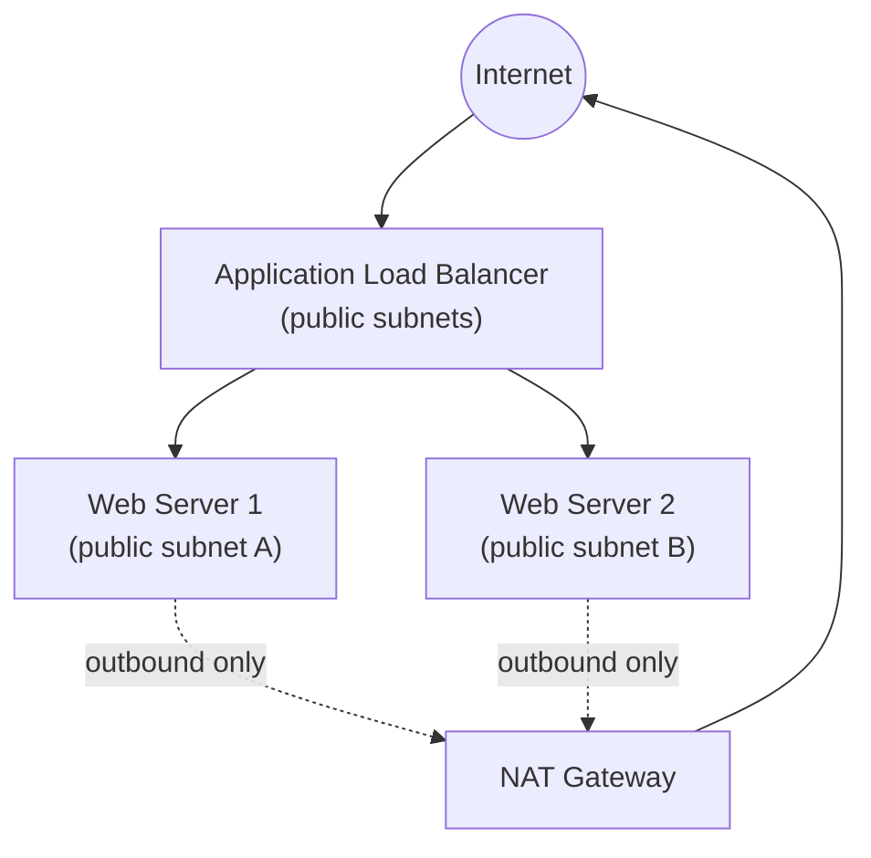

# Infrastructure as Code with Terraform (DevSecOps Track)

> **Level:** Intermediate → Advanced · **Time:** 3–4 hours · **Cost:** ⚠️ Creates billable resources — NAT Gateway, ALB, and 2 EC2 instances are not fully free-tier eligible. Destroy promptly.
> **Related:** This is a standalone, security-focused companion to the step-by-step [Projects 16–19](Project16.md) Terraform series — if you haven't built a VPC/ALB/ASG stack with Terraform before, work through that series first for the conceptual grounding this project assumes.

## Project Overview

This project demonstrates using Terraform for Infrastructure as Code (IaC) to provision and manage AWS infrastructure — a public ALB in front of two web servers, secured, remotely-stated, and wired into a CI/CD pipeline. Terraform allows you to define, provision, and manage cloud infrastructure using a declarative configuration language.

### Architecture Diagram


*A simpler, single-tier version of the architecture built out fully across [Projects 16–19](Project16.md) — useful here because this project's focus is the surrounding practice (security, state, CI/CD), not the network topology itself.*

### Objectives
1. Install and configure Terraform
2. Create Terraform configurations for AWS resources
3. Implement security best practices in Terraform
4. Use Terraform modules for reusable infrastructure
5. Implement state management and backends
6. Use Terraform with CI/CD pipelines

## Prerequisites
- AWS Account with appropriate IAM permissions
- AWS CLI installed and configured
- SSH key pair for EC2 instances

## Step 1: Install Terraform

### Install Terraform on Ubuntu/Debian

```bash
# Add HashiCorp GPG key
curl -fsSL https://apt.releases.hashicorp.com/gpg | sudo gpg --dearmor -o /usr/share/keyrings/hashicorp-archive-keyring.gpg

# Add HashiCorp repository
echo "deb [signed-by=/usr/share/keyrings/hashicorp-archive-keyring.gpg] https://apt.releases.hashicorp.com $(lsb_release -cs) main" | sudo tee /etc/apt/sources.list.d/hashicorp.list

# Update and install Terraform
sudo apt update
sudo apt install terraform -y

# Verify installation
terraform version
```

### Install Terraform on macOS

```bash
# Using Homebrew
brew install terraform

# Verify installation
terraform version
```

## Step 2: Configure AWS Credentials

```bash
# Configure AWS CLI
aws configure

# Or set environment variables
export AWS_ACCESS_KEY_ID="your_access_key"
export AWS_SECRET_ACCESS_KEY="your_secret_key"
export AWS_DEFAULT_REGION="us-east-1"

# Verify credentials
aws sts get-caller-identity
```

## Step 3: Create Basic Terraform Configuration

```bash
# Create project directory
mkdir -p terraform-project && cd terraform-project

# Create main configuration file
cat > main.tf <<EOF
provider "aws" {
  region = var.aws_region
  
  default_tags {
    tags = {
      Environment = var.environment
      Project     = "DevOps-Learning"
      ManagedBy   = "Terraform"
    }
  }
}

# Get latest Amazon Linux 2023 AMI (Amazon Linux 2 reached end of standard support in June 2025)
data "aws_ami" "amazon_linux" {
  most_recent = true
  owners      = ["amazon"]
  
  filter {
    name   = "name"
    values = ["al2023-ami-*-x86_64"]
  }
}

# Create VPC
resource "aws_vpc" "main" {
  cidr_block           = var.vpc_cidr
  enable_dns_hostnames = true
  enable_dns_support   = true
  
  tags = {
    Name = "\${var.environment}-vpc"
  }
}

# Create Internet Gateway
resource "aws_internet_gateway" "main" {
  vpc_id = aws_vpc.main.id
  
  tags = {
    Name = "\${var.environment}-igw"
  }
}

# Create Public Subnets
resource "aws_subnet" "public_1" {
  vpc_id                  = aws_vpc.main.id
  cidr_block              = var.public_subnet_1
  availability_zone       = "\${var.aws_region}a"
  map_public_ip_on_launch = true
  
  tags = {
    Name = "\${var.environment}-public-subnet-1"
    Type = "Public"
  }
}

resource "aws_subnet" "public_2" {
  vpc_id                  = aws_vpc.main.id
  cidr_block              = var.public_subnet_2
  availability_zone       = "\${var.aws_region}b"
  map_public_ip_on_launch = true
  
  tags = {
    Name = "\${var.environment}-public-subnet-2"
    Type = "Public"
  }
}

# Create Private Subnets
resource "aws_subnet" "private_1" {
  vpc_id            = aws_vpc.main.id
  cidr_block        = var.private_subnet_1
  availability_zone = "\${var.aws_region}a"
  
  tags = {
    Name = "\${var.environment}-private-subnet-1"
    Type = "Private"
  }
}

resource "aws_subnet" "private_2" {
  vpc_id            = aws_vpc.main.id
  cidr_block        = var.private_subnet_2
  availability_zone = "\${var.aws_region}b"
  
  tags = {
    Name = "\${var.environment}-private-subnet-2"
    Type = "Private"
  }
}

# Create Elastic IP for NAT Gateway
resource "aws_eip" "nat" {
  domain = "vpc"
  
  tags = {
    Name = "\${var.environment}-nat-eip"
  }
}

# Create NAT Gateway
resource "aws_nat_gateway" "main" {
  allocation_id = aws_eip.nat.id
  subnet_id     = aws_subnet.public_1.id
  
  tags = {
    Name = "\${var.environment}-nat-gw"
  }
  
  depends_on = [aws_internet_gateway.main]
}

# Create Public Route Table
resource "aws_route_table" "public" {
  vpc_id = aws_vpc.main.id
  
  route {
    cidr_block = "0.0.0.0/0"
    gateway_id = aws_internet_gateway.main.id
  }
  
  tags = {
    Name = "\${var.environment}-public-rt"
  }
}

# Associate Public Subnets with Public Route Table
resource "aws_route_table_association" "public_1" {
  subnet_id       = aws_subnet.public_1.id
  route_table_id = aws_route_table.public.id
}

resource "aws_route_table_association" "public_2" {
  subnet_id       = aws_subnet.public_2.id
  route_table_id = aws_route_table.public.id
}

# Create Private Route Table
resource "aws_route_table" "private" {
  vpc_id = aws_vpc.main.id
  
  route {
    cidr_block     = "0.0.0.0/0"
    nat_gateway_id = aws_nat_gateway.main.id
  }
  
  tags = {
    Name = "\${var.environment}-private-rt"
  }
}

# Associate Private Subnets with Private Route Table
resource "aws_route_table_association" "private_1" {
  subnet_id       = aws_subnet.private_1.id
  route_table_id = aws_route_table.private.id
}

resource "aws_route_table_association" "private_2" {
  subnet_id       = aws_subnet.private_2.id
  route_table_id = aws_route_table.private.id
}

# Create Security Group
resource "aws_security_group" "web" {
  name        = "\${var.environment}-web-sg"
  description = "Security group for web servers"
  vpc_id      = aws_vpc.main.id
  
  # Inbound rules
  ingress {
    description = "HTTP"
    from_port   = 80
    to_port     = 80
    protocol    = "tcp"
    cidr_blocks = ["0.0.0.0/0"]
  }
  
  ingress {
    description = "HTTPS"
    from_port   = 443
    to_port     = 443
    protocol    = "tcp"
    cidr_blocks = ["0.0.0.0/0"]
  }
  
  # NOTE: cidr_blocks below is intentionally NOT 0.0.0.0/0 — opening SSH to the
  # entire internet is one of the most commonly exploited AWS misconfigurations.
  # var.ssh_allowed_cidr should be your own IP/VPN range, not a wildcard.
  ingress {
    description = "SSH"
    from_port   = 22
    to_port     = 22
    protocol    = "tcp"
    cidr_blocks = [var.ssh_allowed_cidr]
  }
  
  # Outbound rules
  egress {
    description = "All outbound"
    from_port   = 0
    to_port     = 0
    protocol    = "-1"
    cidr_blocks = ["0.0.0.0/0"]
  }
  
  tags = {
    Name = "\${var.environment}-web-sg"
  }
}

# Create EC2 Key Pair
resource "aws_key_pair" "deployer" {
  key_name   = "\${var.environment}-key"
  public_key = var.public_key
  
  tags = {
    Name = "\${var.environment}-key"
  }
}

# Create Web Server 1
resource "aws_instance" "web_1" {
  ami                    = data.aws_ami.amazon_linux.id
  instance_type          = var.instance_type
  subnet_id              = aws_subnet.public_1.id
  key_name               = aws_key_pair.deployer.key_name
  vpc_security_group_ids = [aws_security_group.web.id]
  user_data              = <<-EOF
              #!/bin/bash
              yum update -y
              yum install -y httpd
              systemctl start httpd
              systemctl enable httpd
              echo "<h1>Web Server 1</h1>" > /var/www/html/index.html
              EOF
  
  tags = {
    Name = "\${var.environment}-web-1"
  }
}

# Create Web Server 2
resource "aws_instance" "web_2" {
  ami                    = data.aws_ami.amazon_linux.id
  instance_type          = var.instance_type
  subnet_id              = aws_subnet.public_2.id
  key_name               = aws_key_pair.deployer.key_name
  vpc_security_group_ids = [aws_security_group.web.id]
  user_data              = <<-EOF
              #!/bin/bash
              yum update -y
              yum install -y httpd
              systemctl start httpd
              systemctl enable httpd
              echo "<h1>Web Server 2</h1>" > /var/www/html/index.html
              EOF
  
  tags = {
    Name = "\${var.environment}-web-2"
  }
}

# Create Application Load Balancer
resource "aws_lb" "main" {
  name               = "\${var.environment}-alb"
  internal           = false
  load_balancer_type = "application"
  security_groups    = [aws_security_group.web.id]
  subnets            = [aws_subnet.public_1.id, aws_subnet.public_2.id]
  
  enable_deletion_protection = false
  
  tags = {
    Name = "\${var.environment}-alb"
  }
}

# Create Target Group
resource "aws_lb_target_group" "main" {
  name     = "\${var.environment}-tg"
  port     = 80
  protocol = "HTTP"
  vpc_id   = aws_vpc.main.id
  
  health_check {
    enabled             = true
    healthy_threshold   = 2
    unhealthy_threshold = 2
    timeout             = 5
    interval            = 30
    path                = "/"
    matcher             = "200"
  }
}

# Register targets
resource "aws_lb_target_group_attachment" "web_1" {
  target_group_arn = aws_lb_target_group.main.arn
  target_id        = aws_instance.web_1.id
  port             = 80
}

resource "aws_lb_target_group_attachment" "web_2" {
  target_group_arn = aws_lb_target_group.main.arn
  target_id        = aws_instance.web_2.id
  port             = 80
}

# Create ALB Listener
resource "aws_lb_listener" "http" {
  load_balancer_arn = aws_lb.main.arn
  port              = "80"
  protocol          = "HTTP"
  
  default_action {
    type             = "forward"
    target_group_arn = aws_lb_target_group.main.arn
  }
}

# Outputs
output "vpc_id" {
  description = "ID of the VPC"
  value       = aws_vpc.main.id
}

output "web_server_1_ip" {
  description = "Public IP of Web Server 1"
  value       = aws_instance.web_1.public_ip
}

output "web_server_2_ip" {
  description = "Public IP of Web Server 2"
  value       = aws_instance.web_2.public_ip
}

output "alb_dns_name" {
  description = "DNS name of the Application Load Balancer"
  value       = aws_lb.main.dns_name
}
EOF
```

### Create Variables File

```bash
# Create variables file
cat > variables.tf <<EOF
variable "aws_region" {
  description = "AWS region"
  type        = string
  default     = "us-east-1"
}

variable "environment" {
  description = "Environment name"
  type        = string
  default     = "dev"
}

variable "vpc_cidr" {
  description = "CIDR block for VPC"
  type        = string
  default     = "10.0.0.0/16"
}

variable "public_subnet_1" {
  description = "CIDR block for public subnet 1"
  type        = string
  default     = "10.0.1.0/24"
}

variable "public_subnet_2" {
  description = "CIDR block for public subnet 2"
  type        = string
  default     = "10.0.2.0/24"
}

variable "private_subnet_1" {
  description = "CIDR block for private subnet 1"
  type        = string
  default     = "10.0.10.0/24"
}

variable "private_subnet_2" {
  description = "CIDR block for private subnet 2"
  type        = string
  default     = "10.0.11.0/24"
}

variable "instance_type" {
  description = "EC2 instance type"
  type        = string
  default     = "t3.micro"
}

variable "public_key" {
  description = "SSH public key"
  type        = string
}

variable "ssh_allowed_cidr" {
  description = "CIDR block allowed to SSH into web servers (your IP/32, not 0.0.0.0/0)"
  type        = string
}
EOF
```

### Create tfvars File

> 🔒 **Note:** never commit a real `dev.tfvars` with a real SSH public key or credentials to a public repo — commit a `dev.tfvars.example` with placeholders instead, and add `*.tfvars` to `.gitignore`.

```bash
# Create environment-specific tfvars
cat > dev.tfvars <<EOF
aws_region        = "us-east-1"
environment       = "dev"
instance_type     = "t3.micro"
public_key        = "ssh-rsa AAAAB3NzaC1..."
ssh_allowed_cidr  = "203.0.113.4/32"
EOF
```

## Step 4: Terraform Commands

```bash
# Initialize Terraform
terraform init

# Format code
terraform fmt

# Validate configuration
terraform validate

# Plan changes
terraform plan -var-file="dev.tfvars"

# Apply changes
terraform apply -var-file="dev.tfvars"

# Apply with auto-approve
terraform apply -var-file="dev.tfvars" -auto-approve

# Show current state
terraform show

# List resources
terraform state list

# Destroy resources
terraform destroy -var-file="dev.tfvars"
```

## Step 5: Terraform Modules

```bash
# Create modules directory
mkdir -p modules/vpc modules/ec2 modules/alb

# VPC Module
cat > modules/vpc/main.tf <<EOF
variable "environment" {
  description = "Environment name"
  type        = string
}

variable "vpc_cidr" {
  description = "CIDR block for VPC"
  type        = string
}

variable "aws_region" {
  description = "AWS region"
  type        = string
}

resource "aws_vpc" "main" {
  cidr_block           = var.vpc_cidr
  enable_dns_hostnames = true
  enable_dns_support   = true
  
  tags = {
    Name = "\${var.environment}-vpc"
  }
}

resource "aws_subnet" "public" {
  count                = 2
  vpc_id               = aws_vpc.main.id
  cidr_block           = cidrsubnet(var.vpc_cidr, 8, count.index)
  availability_zone    = data.aws_availability_zones.available.names[count.index]
  map_public_ip_on_launch = true
  
  tags = {
    Name = "\${var.environment}-public-subnet-\${count.index + 1}"
  }
}

data "aws_availability_zones" "available" {
  state = "available"
}

output "vpc_id" {
  value = aws_vpc.main.id
}

output "public_subnet_ids" {
  value = aws_subnet.public[*].id
}
EOF

# Update main.tf to use module
cat > main.tf <<EOF
provider "aws" {
  region = "us-east-1"
}

module "vpc" {
  source   = "./modules/vpc"
  environment = "dev"
  vpc_cidr = "10.0.0.0/16"
  aws_region = "us-east-1"
}
EOF
```

## Step 6: Remote State Backend

> ⚠️ **`my-terraform-state-bucket` is a placeholder — it's almost certainly already taken.** S3 bucket names are globally unique across every AWS account, not just yours. Substitute your own unique name (e.g. including your AWS account ID) everywhere it appears below, both in `backend.tf` and the `aws s3 mb` command.

```bash
# Create backend configuration
cat > backend.tf <<EOF
terraform {
  backend "s3" {
    bucket         = "my-terraform-state-bucket"
    key            = "dev/terraform.tfstate"
    region         = "us-east-1"
    encrypt        = true
    dynamodb_table = "terraform-locks"
  }
}
EOF
```

### Create S3 Bucket and DynamoDB Table

```bash
# Create S3 bucket for state storage
aws s3 mb s3://my-terraform-state-bucket --region us-east-1

# Enable versioning
aws s3api put-bucket-versioning \
  --bucket my-terraform-state-bucket \
  --versioning-configuration Status=Enabled

# Enable encryption
aws s3api put-bucket-encryption \
  --bucket my-terraform-state-bucket \
  --server-side-encryption-configuration '{"Rules":[{"ApplyServerSideEncryptionByDefault":{"SSEAlgorithm":"AES256"}}]}'

# Create DynamoDB table for state locking
aws dynamodb create-table \
  --table-name terraform-locks \
  --attribute-definitions AttributeName=LockID,AttributeType=S \
  --key-schema AttributeName=LockID,KeyType=HASH \
  --billing-mode PAY_PER_REQUEST \
  --region us-east-1
```

## Step 7: Security Best Practices

### Require MFA to Assume the Terraform Role

> ⚠️ An earlier version of this section claimed that adding an `assume_role` block by itself "requires MFA for console login." **That's not accurate** — `assume_role` just tells the provider to assume a role; it enforces nothing about MFA on its own. MFA enforcement has to live in the IAM role's **trust policy**, via an `aws:MultiFactorAuthPresent` condition, and the caller must supply `mfa_serial`/a token when assuming it.

IAM role trust policy (attach this to `TerraformRole`, not to the Terraform provider config):
```json
{
  "Version": "2012-10-17",
  "Statement": [
    {
      "Effect": "Allow",
      "Principal": { "AWS": "arn:aws:iam::123456789012:root" },
      "Action": "sts:AssumeRole",
      "Condition": {
        "Bool": { "aws:MultiFactorAuthPresent": "true" },
        "NumericLessThan": { "aws:MultiFactorAuthAge": "3600" }
      }
    }
  ]
}
```

```bash
cat > main.tf <<EOF
provider "aws" {
  region = "us-east-1"

  assume_role {
    role_arn     = "arn:aws:iam::123456789012:role/TerraformRole"
    session_name = "terraform-session"
    # Required because the role's trust policy above demands MFA:
    # mfa_serial and a fresh token must be supplied when assuming the role
    # (interactively, or via 'aws sts assume-role --serial-number ... --token-code ...'
    # feeding temporary credentials into the environment before Terraform runs).
  }
}
EOF
```
This is also exactly why CI/CD pipelines (Step 8) typically use a **separate, non-MFA IAM role** scoped tightly to what the pipeline needs, rather than trying to script around an MFA prompt — MFA belongs to interactive human sessions; automation should use short-lived, narrowly-scoped credentials instead (ideally via OIDC federation — see the note in Step 8).

### Secrets Management

> ⚠️ An earlier version of this section hardcoded `password = "secure-password"` directly in the Terraform resource — which defeats the entire point of using Secrets Manager. If the value is typed into your `.tf` code, it's in your Git history and your state file exactly as before; Secrets Manager gains you nothing. Generate it with a `random_password` resource instead, so the actual secret value only ever exists inside Secrets Manager and Terraform's state (which should itself be encrypted, per Step 6) — never in your source code.

```bash
# Use AWS Secrets Manager with Terraform
resource "random_password" "db_password" {
  length  = 24
  special = true
}

resource "aws_secretsmanager_secret" "db_password" {
  name = "dev/db_password"

  # 7-30 days recommended in production so an accidental deletion can be recovered.
  # 0 (immediate, unrecoverable deletion) is only appropriate for short-lived dev/test secrets.
  recovery_window_in_days = 7
}

resource "aws_secretsmanager_secret_version" "db_password" {
  secret_id = aws_secretsmanager_secret.db_password.id
  secret_string = jsonencode({
    username = "admin"
    password = random_password.db_password.result
  })
}
```
Your application then reads the secret at runtime via the AWS SDK/CLI (`aws secretsmanager get-secret-value`) or an IAM instance profile with `secretsmanager:GetSecretValue` scoped to this one secret's ARN — it never needs the value typed anywhere in your codebase.

## Step 8: CI/CD Integration

> ⚠️ An earlier version of this workflow set `continue-on-error: true` on the Terraform Plan step. That's a serious anti-pattern in exactly the scenario shown here: if `plan` fails (bad syntax, an invalid AWS call, whatever), the workflow would carry on anyway and — on `main` — proceed straight to `apply -auto-approve`, silently applying against an error state instead of stopping. A CI pipeline's job is to stop bad changes before they reach infrastructure; swallowing the one step that would have caught the problem defeats that. Removed below.
>
> 💡 **Also consider OIDC over long-lived access keys.** The example below uses static `AWS_ACCESS_KEY_ID`/`AWS_SECRET_ACCESS_KEY` GitHub secrets — functional, but long-lived keys stored as CI secrets are a standing risk if the repo or a runner is ever compromised. `aws-actions/configure-aws-credentials` also supports OIDC federation (`role-to-assume`, no stored keys at all, short-lived credentials issued per-run) — the modern recommended approach, and worth migrating to once you're comfortable with the static-key version below.

```bash
# Create GitHub Actions workflow
mkdir -p .github/workflows

cat > .github/workflows/terraform.yml <<EOF
name: Terraform CI/CD

on:
  push:
    branches: [main]
  pull_request:
    branches: [main]

jobs:
  terraform:
    name: Terraform
    runs-on: ubuntu-latest
    
    steps:
      - name: Checkout
        uses: actions/checkout@v3
      
      - name: Setup Terraform
        uses: hashicorp/setup-terraform@v2
        with:
          terraform_version: 1.9.0
      
      - name: Configure AWS Credentials
        uses: aws-actions/configure-aws-credentials@v2
        with:
          aws-access-key-id: \${{ secrets.AWS_ACCESS_KEY_ID }}
          aws-secret-access-key: \${{ secrets.AWS_SECRET_ACCESS_KEY }}
          aws-region: us-east-1
      
      - name: Terraform Format
        run: terraform fmt -check
      
      - name: Terraform Init
        run: terraform init
      
      - name: Terraform Validate
        run: terraform validate
      
      - name: Terraform Plan
        run: terraform plan -var-file="dev.tfvars"
      
      - name: Terraform Apply
        if: github.ref == 'refs/heads/main'
        run: terraform apply -var-file="dev.tfvars" -auto-approve
EOF
```

## Step 9: Workspaces

```bash
# Create new workspace
terraform workspace new dev
terraform workspace new staging
terraform workspace new prod

# List workspaces
terraform workspace list

# Select workspace
terraform workspace select dev

# Use workspace in configuration
resource "aws_instance" "example" {
  ami           = "ami-12345678"
  instance_type = terraform.workspace == "prod" ? "t3.large" : "t3.micro"
  
  tags = {
    Name = "example-\${terraform.workspace}"
  }
}
```

---

## Troubleshooting

| Symptom | Likely Cause | Fix |
|---|---|---|
| `terraform apply` fails with `InvalidAMIID.NotFound` | The `al2023-ami-*-x86_64` filter matched nothing in your region, or your provider region doesn't match where you expect | Confirm `var.aws_region` and try the filter manually: `aws ec2 describe-images --owners amazon --filters "Name=name,Values=al2023-ami-*-x86_64"` |
| `BucketAlreadyExists` on `aws s3 mb` | S3 bucket names are globally unique — `my-terraform-state-bucket` (or any name copied from a tutorial) is very likely taken | Pick a unique name (e.g. append your AWS account ID) and use it consistently in `backend.tf` and every `aws s3`/`aws dynamodb` command |
| `terraform init` fails after adding `backend.tf`: `Error: Backend configuration changed` | Expected — Terraform is asking you to confirm migrating from local to the new S3 backend, not reporting a real error | Run `terraform init` again and answer `yes` to "Do you want to copy existing state to the new backend?" |
| CI pipeline's `Terraform Apply` step fails with credential errors even though `Configure AWS Credentials` succeeded | Using static access keys stored as GitHub secrets that have expired, been rotated, or were scoped to the wrong account | Verify the secrets are current; consider migrating to OIDC federation (noted in Step 8) so there are no long-lived keys to expire or leak in the first place |
| `assume_role` fails with `AccessDenied` after adding the MFA trust policy condition | Assuming the role without actually supplying an MFA token/serial — the trust policy now requires it | Assume the role via `aws sts assume-role --role-arn ... --serial-number <mfa-arn> --token-code <current-otp>` first, export the resulting temporary credentials, *then* run Terraform — the provider's `assume_role` block alone can't prompt for a live MFA code interactively in all execution contexts |
| Web servers behind the ALB show as unhealthy in the target group | Security group doesn't allow the ALB to reach port 80 on the instances, or `user_data` (httpd install) failed silently | Check the target group's health check settings match what's actually running; SSH in (using your now-restricted `ssh_allowed_cidr`) and check `sudo systemctl status httpd` and `/var/log/cloud-init-output.log` |
| `terraform plan` in CI shows unexpected changes that don't happen locally | Local Terraform CLI version differs from `terraform_version` pinned in the GitHub Actions workflow | Keep your local Terraform version and the CI-pinned version (`hashicorp/setup-terraform`) in sync — different minor versions can format state or plan output subtly differently |

---

## Best Practices Summary

- **Never hardcode secrets in `.tf` files** — generate them (`random_password`) or reference an external secrets manager; a value typed into HCL is a value sitting in your Git history and state file forever.
- **Scope security groups to the minimum necessary** — no `0.0.0.0/0` on SSH, ever; restrict to a known CIDR or eliminate the need for SSH entirely via SSM Session Manager.
- **CI should never auto-apply past a step it didn't actually check** — `continue-on-error` on a `plan` step immediately followed by an `-auto-approve` apply is a good way to ship a broken or unintended change straight to production.
- **State backends need globally-unique, purpose-specific names** and their own security hardening (versioning, encryption, public-access block) — treat the state bucket itself as a piece of production infrastructure, not an afterthought.
- **Prefer OIDC federation over long-lived CI secrets** wherever your CI platform supports it (GitHub Actions, GitLab CI, and most modern CI platforms do) — short-lived, per-run credentials eliminate an entire class of "leaked secret" incidents.

---

## Real-World Scenario

This project's shape — a small, security-hardened, CI/CD-deployed Terraform stack — is closer to how a real platform team's *first* production Terraform project actually looks than the full multi-tier build in [Projects 16–19](Project16.md): start small (one ALB, a couple of instances), get the *practices* right from day one (remote state, secrets management, CI gating, least-privilege IAM), and only then grow the architecture's complexity. Teams that build a large, complex Terraform codebase first and bolt security/CI on afterward almost always end up doing a painful retrofit — the practices in this project (Steps 6–8 especially) are cheaper to build in from the start than to add later.

---

## Challenge

1. **Migrate the CI pipeline to OIDC.** Set up an IAM OIDC identity provider trusting GitHub Actions, create a role scoped to this project's needs, and replace the static `AWS_ACCESS_KEY_ID`/`AWS_SECRET_ACCESS_KEY` secrets with `role-to-assume` in the `configure-aws-credentials` step.
2. **Add a `terraform plan` PR comment step** to the GitHub Actions workflow (using `hashicorp/setup-terraform`'s output or a community action) so reviewers see the plan directly in the pull request, not just in CI logs.
3. **Convert the EC2/ALB section into a proper module** (following Step 5's `vpc` module pattern), with `environment`-driven sizing so the same code stands up a smaller `dev` and a larger `prod` from one codebase.
4. **Add `aws_s3_bucket_public_access_block`** to the state bucket, and `terraform destroy` this project entirely, then rebuild it from scratch using only the corrected code in this file — the fastest way to confirm you've actually internalized every fix, not just read past them.

---

## Interview Q&A

**Q: Why is `continue-on-error: true` dangerous on a Terraform Plan step specifically, in a pipeline that auto-applies on `main`?**
A: It converts a genuine failure (bad syntax, an invalid change, a broken reference) into something the pipeline treats as "fine, keep going" — and the very next step is `apply -auto-approve`. The plan step exists specifically to catch problems *before* they touch real infrastructure; silencing its failure and proceeding anyway removes the one safety check the pipeline had at exactly the moment it mattered.

**Q: Why doesn't wrapping the AWS provider in an `assume_role` block actually enforce MFA, even though it "assumes a role"?**
A: `assume_role` only describes *which* role to assume and *how* (session name, external ID, etc.) — it doesn't add any authentication requirement on its own. MFA enforcement is a property of the *role being assumed*, specifically an `aws:MultiFactorAuthPresent` condition in that role's trust policy. Without that condition, the role can be assumed with or without MFA; the `assume_role` block is enforcing nothing by itself.

**Q: What's the actual security benefit of generating a secret with `random_password` and storing it in Secrets Manager, versus just typing a strong password directly into `secret_string`?**
A: If the value is typed into `.tf` code, it exists in plaintext in your Git history (forever, even if later removed) and in Terraform's state file — exactly the exposure Secrets Manager was supposed to prevent. Generating it with `random_password` means the actual secret value is never written into your source code at all; it only ever exists inside the state (which should be encrypted) and inside Secrets Manager itself, where access is controlled by IAM policy and every read is logged via CloudTrail.

**Q: Why prefer OIDC federation over storing AWS access keys as CI/CD secrets?**
A: Long-lived access keys stored as CI secrets are a standing liability — if the repo, a fork's PR, or a compromised runner ever leaks them, they're valid until someone notices and manually rotates them. OIDC federation issues short-lived, per-run credentials directly to the CI job via a trust relationship between your CI platform and AWS IAM — there's no long-lived secret to leak in the first place, and a compromised run's credentials expire on their own shortly after.

**Q: If a target group shows all instances unhealthy right after `terraform apply`, how do you narrow down whether it's a networking problem or an application problem?**
A: Check the target group's health check configuration against what's actually running first (right port, right path, matching expected status code). If that looks correct, the fastest split is: can you reach the instance directly (bypassing the ALB) on the health check port? If yes, it's a security-group/network path problem between the ALB and the instance; if no, it's an application/bootstrap problem on the instance itself — check `user_data` logs next.

---

## Next Steps

- **[Projects 16–19](Project16.md)** — the fuller, four-part Terraform build-out (multi-tier architecture, modules, Terraform Cloud) this project's practices apply to at scale.
- **[Project 25](Project25.md)** — wire SAST/DAST security scanning into the CI/CD pipeline built here.
- **[Project 26](Project26.md)** — replace this project's Secrets Manager usage with HashiCorp Vault for dynamic, short-lived credentials.
- **[Project 27](Project27.md)** — go deeper on the IAM/MFA concepts touched on in Step 7.

## Additional Resources
- [Terraform Documentation](https://www.terraform.io/docs)
- [AWS Provider Documentation](https://registry.terraform.io/providers/hashicorp/aws/latest/docs)
- [Terraform Best Practices](https://www.terraform.io/docs/cloud/guides/recommended-practices/index.html)
